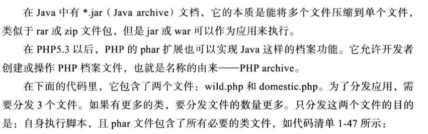
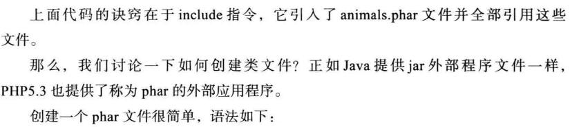

# 第1章 PHP解惑
## 1.1 省略结束标签的便利性
## 1.2 empty、isset、is_null的区别

- isset() 用来检测一个变量是否已声明且值不为NULL
- empty() 用来检测一个变量是否为空：空字符串，false，空数组[array()],NULL，0，''，以及被unset删除后的变量。
- is_null() 只针对已声明变量

## 1.3 布尔值的正确打开方式（TRUE/FALSE 建议大写，因为是常量）

## 1.4 变量作用域实践（函数体内访问外部变量 `global $globalName`）

## 1.5 多维数组排序

- 一维数组排序常用sort()、ksort()等
- 二维、多维数组排序，需要自定义排序函数:

`uasort()`函数接受两个参数，并且返回一个值表示那个参数应该排在前面。负数或者FALSE意味着第一个参数应该排在第二个参数之前。正数或者TRUE表示第二个参数应该排前面，如果值为0，则表示两个参数相等。

```php
<?php

//定义多维数组
$a = array(
    array('sky', 'blue'),
    array('apple', 'red'),
    array('tree', 'green'),
);
//自定义数组比较函数，按数组的第二个元素进行比较
function my_compare($a, $b) {
    if($a[1] < $b[1]) {
        return -1;
    } else if($a[1] == $b[1]) {
        return 0;
    } else {
        return 1;
    }
}

//排序
uasort($a,'my_compare'); //PHP会把内层数组不断地发送给自定义函数
//输出结果
print_r($a);
```

## 1.6 超级全局数组

超级全局数组（super global array）是由PHP内置的，无须开发者重新定义。PHP执行脚本时会自动收集信息并赋值给这些数组。共有十多个分类。

| 名称 | 功能 |
|--------|--------|
| $_GET[]       |   取得用GET方法提交的表单内容，数组键和值分别对应元素名和值     |
| $_POST[]       |   取得用POST方法提交的表单内容，数组键和值分别对应元素名和值     |
| $_COOKIE[]       |   取得或设置当前站点的Cookie     |
| $_SESSION[]       |   取得当前用户访问的会话，以数组形式体现，如sessionid及自定义session数据     |
| $_ENV[]       |   当前PHP服务器的环境变量     |
| $_SERVER[]       |   当前PHP运行环境的服务器变量     |
| $_FILES[]       |   用户上传文件时提交到当前脚本参数     |
| $_REQUEST[]       |   包含当前脚本提交的所有请求，它包含了$_GET[]、$_POST[]、$_COOKIE[]、$_SESSION[]这些超级全局数组的全部内容     |
| $GLOBALS[]       |   该超级变量数组包含正在执行脚本时所有超级全局数组的内容     |

## 1.7 global 关键字与 global 数组的区别

`$GLOBALS['var']` 是外部的全局变量本身，`global $var` 是外部$var的同名引用或者指针，如：

- $GLOBALS['var']

```php
<?php

$var1 = 1;

function test() {
    unset($GLOBALS['var1']);
}

test();
echo $var1; //因为$var1变量被删除，所以没有内容显示出来
```

- global $var

```php
<?php

$var1 = 1;

function test() {
    global $var1;
    unset($var1);
}

test();
echo $var1; //输出 1
```

综上：
- $GLOBALS['var'] 是外部的全局变量本身
- global $var 是外部$var的同名引用或者指针

## 1.8 活用静态变量（静态变量 在函数执行完时不会销毁，脚本执行完时才销毁）

函数内部创建的局部变量，会在函数执行完毕时立即删除。有时为了保存上次局部变量执行的结果，以便下次执行时使用，这时就可以用静态变量来实现。

```php
<?php

function myFunction() {
    static $myVar = 0;
    echo ++$myVar;
}

myFunction(); // 1
myFunction(); // 2
myFunction(); // 3
```

## 1.9 require、require_once、include、include_once与autoload

- 没有once意味着允许多次执行
- include()、include_once()，包含失败会显示警告错误，然后还会继续执行。如果是require()、require_once(),包含文件失败后会抛出致命错误并中止脚本
- 生产环境中，注意千万不要把程序错误信息抛给用户，可在代码中使用error_reporting(0)禁止所有的错误显示，内部加入完善的错误及日志处理，显示给用户正常内容即可。
- require_once()要慢于require，使用autoload速度最快。

Apache为我们提供了ab工具，用来测试脚本性能，及并发。

`ab -c 10 -n 100000 localhost/index.php` 模拟了10万个请求，同一时间有10个并发请求

## 1.10 = 与 =\=、===的区别
## 1.11 HereDoc 与 NowDoc

```php
<?php

$a = 'hallo';

$hereDoc = <<<HEARDOC
 {$a} world;
HEARDOC;

$nowDoc = <<<'NOWDOC'
 {$a} world;
NOWDOC;

echo $hereDoc; // hallo world;
echo '\n';
echo $nowDoc; // {$a} world;
```

## 1.12 函数传值与引用

函数传值的两种方式：

- 传值

括号内加入相应变量名：

`function getUserInfo($f,$s,$t){}`

使用`func_get_arg()`函数来直接处理：

```php
function getUserInfo() {
    $f = func_get_arg(0);
    $s = func_get_arg(1);
    $t = func_get_arg(2);
}
```

如果还觉得繁琐，可以将`func_get_arg()`函数返回的内容交给数组，再进行处理：

```php
function getUserInfo() {
    $args = func_get_args();
    $f = $args(0);
    $s = $args(1);
    $t = $args(2);
}
```

※ 值传递，不是引用！举例：$a = $b; 删除$a，不影响$b;

- 引用

需要在对应的参数前加上“&”符号

```php
function build_now(&$text) { //函数的形参需要+‘&’
    return $text;
}

$t = 'hallo';
$row = &build_now($t); //引用方式调用函数
echo $t;
```

※ `&build_now($t)` 注意，调用函数时也需要用&符号来声明是引用操作。

## 1.13 避免使用过多参数

尽量避免在函数或方法中使用过多的参数。也不提倡使用全局变量！

- 使用数组

```php
$bar = func(array('dude', 'where is my', 'car'));

function func($args) { //使用数组作为参数
    $f = $args[0];
    $s = $args[1];
    $t = $args[2];
}
```

- 使用对象

```php
//User类 用来定义参数
class User {
    public $user_name;
    public $type;
    public $email;
    public $address;
    public $city;
    public $country;
    public $gender;
    //...
}

class UserCsvTemplate {
    //传入User类
    public function render(User $user) {
        echo $user->user_name, ';', $user->country; //获取对应参数
    }
}

//先实例化User,然后赋值
$user = new User();
$user->user_name = 'xiaoming';
$user->country = 'guangzhou';

$template = new UserCsvTemplate();
$template->render($user); //调用时传入user对象
```

※ 这种方式可以准确获取参数，又能避免方法参数过多！推荐！

## 1.14 匿名函数

- 匿名函数赋值给变量

```php
$greet = function($name) {
    printf('hello %s', $name);
};

$greet('xiaoming');
```

- array_map()函数

```php
function format_name($name) {
    echo "{$name}/";
}

$names = array('xiaoming', 'dazhuang');
array_map('format_name', $names); //输出 xiaoming/dazhuang/

// array_map() 第一个参数是函数名，第二个参数是个数组。数组内的每个元素都将使用之前的函数遍历一遍。
```

- 无名字的匿名函数

```php
array_map(function($val) {
    //etc
}, $names);
```

好处：相关代码、函数定义与隐式调用精密结合。
坏处：有可能出现解释错误。出现错误时，可以把函数中代码放进一个正常的函数体中执行，调试到没有问题为止。

- 匿名函数可以使用闭包(比较少用)

```php
$x = 3;
$func = function() use (&$x) {
    $x *= 2;
};
$func();
echo $x; // 打印结果为 6
```

## 1.15 return 与 exit

想要在方法里中断函数的运行并返回调用处时要使用无返回值的return， 而不要使用exit 或 exit()函数。

## 1.16 is_callable() 与 method_exists() 函数

检查一个对象里的方法是否存在？常用 `method_exists($object, 'SomeMethod')`。但该方法仅能判断是否存在方法，却无法判断方法是否可访问（protected/private）,会报fetal error错误。

举例说明 is_callable() 与 method_exists() 的区别：

```php
class Foo {
    public function PublicMethod() {}
    private function PrivateMethod() {}
    public static function PublicStaticMethod() {}
    private static function PrivateStaticMethod() {}
}

$foo = new Foo();

$callbacks = array(
    array($foo, 'PublicMethod'),
    array($foo, 'PrivateMethod'),
    array($foo, 'PublicStaticMethod'),
    array($foo, 'PrivateStaticMethod'),
    array('Foo', 'PublicMethod'),
    array('Foo', 'PrivateMethod'),
    array('Foo', 'PublicStaticMethod'),
    array('Foo', 'PrivateStaticMethod'),
);

foreach($callbacks as $callback) {
    var_dump($callback);
    var_dump(method_exists($callback[0], $callback[1]));
    var_dump(is_callable($callback));
    echo str_repeat('-', 40);
    echo "\n";
}
```

输出

```bash
array(2) {
  [0]=>
  object(Foo)#1 (0) {
  }
  [1]=>
  string(12) "PublicMethod"
}
bool(true)
bool(true)
----------------------------------------
array(2) {
  [0]=>
  object(Foo)#1 (0) {
  }
  [1]=>
  string(13) "PrivateMethod"
}
bool(true)
bool(false)
----------------------------------------
array(2) {
  [0]=>
  object(Foo)#1 (0) {
  }
  [1]=>
  string(18) "PublicStaticMethod"
}
bool(true)
bool(true)
----------------------------------------
array(2) {
  [0]=>
  object(Foo)#1 (0) {
  }
  [1]=>
  string(19) "PrivateStaticMethod"
}
bool(true)
bool(false)
----------------------------------------
array(2) {
  [0]=>
  string(3) "Foo"
  [1]=>
  string(12) "PublicMethod"
}
bool(true)
bool(true)
----------------------------------------
array(2) {
  [0]=>
  string(3) "Foo"
  [1]=>
  string(13) "PrivateMethod"
}
bool(true)
bool(false)
----------------------------------------
array(2) {
  [0]=>
  string(3) "Foo"
  [1]=>
  string(18) "PublicStaticMethod"
}
bool(true)
bool(true)
----------------------------------------
array(2) {
  [0]=>
  string(3) "Foo"
  [1]=>
  string(19) "PrivateStaticMethod"
}
bool(true)
bool(false)
----------------------------------------
```

※ 结论：无论对象或者类本身，无论是否静态方法。method_exists()只能判断是否存在方法，存在返回True，不存在返回False。is_callable()可以判断方法是否存在，是否可访问，存在且可访问返回True，不存在或者不可访问返回False。

如果一个对象存在模式方法_\_call()，在进行方法判断时 method_exists() 会返回 FALSE ,而 is_callback() 会返回 TRUE :

```php
class MethodTest {
    public function __call($name, $arguments) {
        echo "calling object method {$name} " . implode(', ', $arguments);
        echo "\n";
    }
}

$obj = new MethodTest();
$obj->runtest('in object context');
var_dump(method_exists($obj, 'runtest')); // bool(false)
var_dump(is_callable(array($obj, 'runtest'))); // bool(true)
```

| 比较内容 | method_exists() | is_callback() |
|--------|--------|--------|
| 适用范围  |   仅适用于判断类方法     |  可以判断全局函数，也可以判断类方法      |
| 是否有上下文       |   否     |   是，会判断一个函数是否在当前环境中可调用     |
| 是否判断权限       |   否     |   是，在类外，判断private 和 protected 方法会返回FALSE     |
| 是否调用_\_call方法       |   否     |   是     |
| 速度       |    快    |    慢    |

## 1.17 执行外部程序

有两种方法 ``out = `ls -al` `` 反引号； 或者函数  `$out = shell_exec('dir')`。

结果是相同的。区别在于，用`` ` `` 符号会将返回结果放在一个数组，而 `shell_exec()` 函数则会将返回结果放在一个标量变量中。(※书中这段有问题，经测试，两种方法都是放入一个标量变量中(string)，不知道作者使用的是哪个版本)

## 1.18 安全模式的使用说明(safe_mode)


## 1.19 提前计算循环长度

foreach 循环是访问数组元素性能最佳的方法，速度远胜于 while、for

## 1.20 SQL 组合优化

## 1.21 文件处理

在操作前，需要确认脚本对某个文件或目录有相应的文件系统的读写权限，包括安全模式及Apache 或 Nginx 的权限设置。

- `fopen()` 函数的模式，请查手册。

- 可以使用 `file()` 函数读取整个文件到一个数组中(可选参数请查手册)：

```php
$lines = file('file_path');
foreach($lines as $line_num => $line) {
    echo "Line #{$line_num} : {$line} n";
}
```

- `file_get_contents()` 函数可以一次读取文件的全部内容，它接受两个额外参数时很有用，分别是 `offset` 和 `MAXLEN`，offset 偏移指定从哪里开始读取，MAXLEN指定从源文件读取的字节数。

- `file_get_contents()` 和 `file_put_contents()` 函数是绝配。可读取远端URL文件。

- `readfile()` 函数会读取文件到输出缓冲区，返回已读取的字节数。

```php
// 使用readfile()
$file = '/home/xiaoming/1.txt';
$bytesRead = readfile($file); //cli模式下，调用直接就输出了
echo $bytesRead; //打印出字节数
```

- `fgets()` 函数 帮我们读取文件时从文件指针的位置开始读取一行，并作为一个字符串返回，也可以指定想让它读取的字节长度。

```php
$file = "file_path";
$handle = fopen($file, 'rt'); //打开文件 返回句柄
if($handle) {
    while(!feof($handle)) { //判断是否到达文件末尾
        $buffer = fgets($handle, 8192);
        echo $buffer;
    }
    fclose($handle);
}
```

- `fread()` 主要用来读取二进制文件。

```php
$file = "file_path";
// 如果是windows系统用rb
$handle = fopen($file, 'r');
$contents = fread($handle, filesize($file));
fclose($handle);
```

- 从一个网址读取一个二进制文件

```php
$handle = fopen('http://i.stack.imgur.com/968et.png', 'r');
$contents = '';
while(FALSE !== $handle && !feof($handle)) {
    $contents = $contents . fread($handle, 8292);
}
FALSE !== $handle && fclose($handle);
var_dump($contents);
```

## 1.22 goto语句：最后的手段（尽量不用）

## 1.23 利用phar扩展来节省空间



```php
include('phar://animals.phar/wild.php'); //注意写法
include('phar://animals.phar/demestic.php');
$test = animal();
//...
```



`phar pack -f animals.phar -c gz wild.php demestic.php`


## 1.24 手册上的小瑕疵


## 1.25 本章小结

# 第2章 深入PHP面向对象

## 2.1 PHP 与面向对象
## 2.2 面向对象的一些概念
## 2.3 类和对象
## 2.4 使用对象
## 2.5 构造方法和析构方法
## 2.6 实例与多态
## 2.7 类的拓展
## 2.8 防止重写

如果将方法声明为 `final` 方法，它不能被任何子类覆盖/重写。

## 2.9 防止被扩展
## 2.10 多态性

`$htmlmailer instanceof emailer` instanceof 关键字，用来判断当前对象与类的关系
## 2.11 接口

方法体必须都是空的，可有属性和指定方法参数。 实现类需要使用关键字 `implements`

```php
interface DBDriver {
    public function connect();  // 注意：没有大括号！！且必须有分号`；`！！
    public function execute($sql);
}
```

## 2.12 抽象类

抽象类和接口几乎相同，只不过抽象类的方法体可以包含内容。 使用关键字 `extended`

```php
abstract class DBDriver { //声明抽象类
    public function connect() {}    // 注意：一定有大括号！！且没有分号`；`！！
    public function execute($sql) {}
}
```

类似声明抽象类，还可以声明抽象方法。当一个方法声明为抽象时，意味着子类必须重写该方法。一个抽象的方法不包含任何内容。声明如下：

`abstract public function connectDB();` //注意：没有大括号！！且必须有分号`；`！！

## 2.13 静态方法和属性
## 2.14 魔术方法

- `__get()` 与 `__set()` 存取类中没有定义的成员方法和属性

 当试图写入已给不存在或者不可见的属性时，PHP就会执行类中的 `__set()`方法.

```php
class myShop {
    private $p = array();

    function __set($name, $value) { //两个参数 属性名称+属性值
        echo "set::$name:$value \n";
        $this->p[$name] = $value; //将属性名及值存入数组中，给__get()调用
    }

    function __get($name) { //一个参数 属性名称
        print "get::$name \n";
        return array_key_exists($name, $this->p) ? $this->p[$name] : null;
    }
}

$shop = new myShop();
$shop->apple = 2;
$shop->pear = 3;
$shop->pear++; //会先执行__get(), 再执行__set()
echo "苹果={$shop->apple}\n";
echo "梨={$shop->pear}\n";
```

输出：

```bash
set::apple:2 
set::pear:3 
get::pear 
set::pear:4 
get::apple 
苹果=2
get::pear 
梨=4
```

- `__call()` 用于调用类中不存在或不可见的方法

试图调用类中一个不存在或不可见的方法时，PHP会执行该类中的 `__call()` 方法。

```php
class MyShop {
    private $obj;

    function __construct($obj) {
        $this->obj = $obj;
    }

    function __call($method, $args) {
        print "{$method}::" . implode($args, ',') . "\n";
        if(isset($this->obj) && method_exists($this->obj, $method)) {
            return call_user_func_array(array($this->obj, $method), $args); //调用某个对象的方法，并传入参数
        }
    }
}

class Calculate {
    private $items = 0;

    function add($num) {
        $this->items += $num;
    }

    function sum() {
        return $this->items;
    }
}

$obj = new Calculate();
$shop = new MyShop($obj);
$shop->add(2);
print $shop->sum() . "\n";
```

输出：

```bash
add::2
sum::
2
```

- `__sleep()` 与 `__wakeup()` 序列化和反序列化一个实例

  `__sleep()`方法在序列化(serialize)一个实例的时候被调用，`__wakeup()`则是在反序列化(unserialize)的时候被调用。注意，`__sleep()`必须返回一个数组或者对象（一般返回的是当前对象`$this`），返回的值将会被用来做序列化的值，如果不返回这个值，则表示序列化失败。这也意味着反序列化不会触发`__wakeup()`事件。


- `__toString()` 把类的实例转化为字符串
- `__autoload()` 自动引入类 大小写敏感

## 2.15 命名空间

绝对不会出错的调用：

```php
namespace Fred;
$courier = new \shipping\Courier();
```

## 2.16 trait(PHP5.4) 解决代码复用问题

用来解决PHP只能单继承的问题，提高代码复用。

```php
Trait examTrait {
    //可定义属性
    //定义了一个方法
    public function dumpObject() {
        echo get_class($this) . "\n"; //打印调用该方法的当前类名
    }

    protected function protected_method() {
        echo "protected_method\n";
    }

    private function private_method() {
        echo "private_method\n";
    }
}

class class_1 {
    use examTrait; //相当于继承了examTrait。跟继承的特性一模一样
}

class class_2 {
    use examTrait;
}

$class_1 = new class_1();
$class_2 = new class_2();

$class_1->dumpObject(); //输出 class_1
$class_2->dumpObject(); //输出 class_2

$class_1->protected_method(); //PHP Fatal error
$class_2->protected_method(); //PHP Fatal error

$class_1->private_method(); //PHP Fatal error
$class_2->private_method(); //PHP Fatal error
```

# 第3章 PHP输出缓冲区

## 3.1 系统缓冲区

缓冲区，实际上是一个内存地址空间，用来解决存储速度不同步的设备或者优先级不同的设备之间的数据传输。

## 3.2 什么是PHP输出缓冲区

对于PHP中的输出缓冲层，需要了解3点内容：

- 任何会输出内容的函数都会用到输出缓冲区，如`echo、printf()`函数。只针对正常的PHP脚本，不包括PHP扩展，有些扩展会将输出写入到SAPI缓冲区层，不需要经过输出缓冲区。
- 输出缓冲区层不是唯一用于缓冲输出的层，它实际上只是多层中的一个。输出缓冲区层的行为与你使用的SAPI(WEB或CLI)有关，不同的SAPI可能有不同的行为。(如下图，最上端的两层就是通常所说的“输出缓冲区”)

- SAPI的输出缓冲区。

`PHP CLI`下的 `php.ini` 配置文件中 `output_buffer` 选项默认是0的，这表示禁用了PHP输出缓冲区。所以在CLI中，默认情况下一旦输出内容就会直接传递到SAPI层，除非手动调用 `ob_()` 类的函数。此外，`implicit_flush()` 的值也被设置为1，这代表一点有任何输出写到SAPI缓冲层，它都会立即刷新（flush,意思是把这些数据写到更底层，并且清空缓冲区）

### 3.2.1 默认PHP输出缓冲区

如果使用不同于CLI的SAPI，比如PHP-FPM，会用到下面3个与缓冲区相关的 `php.ini` 文件的配置选项：

- `output_buffering` 默认为4.96字节，如果设为0，则表示禁用输出缓冲区，如果设为ON，则默认的输出缓冲区大小为16KB
- `implicit_flush` 对于FastCGI协议，该项默认是OFF，每次发送数据包前会先把FastCGI的缓冲区写满再发送，也可调用flush()函数手动刷新。如果希望写一次就刷新一次，可以设置该项为ON,或者调用一次ob_implicit_flush()函数
- `output_handler` 一个回调函数，它可以在缓冲区刷新之前修改缓冲区中的内容。PHP的扩展提供了很多的回调函数（ob_gzhandler、mb_output_handler...也可以自己写）

在运行时使用ini_set()函数修改这几个选项的值，是没有效果，没用的！因为这三个选项，是在脚本运行前就被加载解析的。

推荐在php.ini中使用如下配置：
```
output_buffering = 4096  //可修改为4或8的倍数，分别对应32位与64位操作系统
implicit_flush = false
```

### 3.2.2 消息头和消息体

任何协议都必须在发送`消息体`之前发送`消息头`。

当使用输出函数时，内容会被先写入输出缓冲区（可能是多个）。当这输出缓冲区中的内容需要被发送时，PHP会先发送消息头，然后再发送消息体。PHP为你搞定了所以事情。如果想自己动手，那只能禁用输出缓冲区，除此之外，别无他法。

### 3.2.3 用户输出缓冲区

```php
<?php

/**
 * 这些用户缓冲区，会组成一个堆栈结构，每个新建缓冲区都会堆叠到之前的缓冲区上，
 * 每当它被填满或者溢出，都会执行刷新操作，然后把其中的数据传递给下一个缓冲区。
 */

//用户缓冲区1
ob_start(function($ctc) {
    static $a = 0;
    return $a++ . '- ' . $ctc . "\n";
}, 10);

//用户缓冲区2
ob_start(function($ctc) {
    return ucfirst($ctc);
}, 3);

echo "fo";//无输出！fo被传入缓冲区2
sleep(2);
echo 'o';//无输出！Foo被传入缓冲区1
sleep(2);
echo "barbazz"; // 输出 '0-FooBarbazz'
sleep(2);
echo "hello"; // 输出 '1-Hello'

/**
 * 1.安装栈的后进先出原则，任何输出都会先存放到缓冲区2
 * 2.缓冲区2的大小为3个字节，所以第一个echo语句输出的字符串'fo'(2个字节)会先存放在缓冲区2中，还差一个字符.
 * 3.当第二个echo语句输出'o'后，缓冲区2满了，所以它会刷新。
 * 4.在刷新之前会调用ob_start()的回调函数，这个函数会将缓冲区内的字符串的首字母转换成大写，所以输出为'Foo'。
 * 5.'Foo'会被保存在缓冲区1中,缓冲区1的大小为10.
 * 6.第三个echo语句会输出‘barbazz’，它还是会先放到缓冲区1中，这个字符串有7个字节，缓冲区1已经溢出了，所以它会立即刷新。调用回调函数得到结果‘Barbazz’,然后被传递到缓冲区2中。
 * 7.这个时候缓冲区2中保存了'FooBarbazz',10个字符，缓冲区1会刷新，同样会调用ob_start()的回调函数。输出 '0-FooBarbazz'
 * 8.最后一个echo语句输出了字符串'hello',它大于3个字符，所以会触发缓冲区2刷新，因为此时脚本已经执行结束，所以也会立即刷新缓冲区1。最终输出'1-Hello'
 */
```

## 3.3 输出缓冲区的机制

## 3.4 输出缓冲区的陷阱

很多PHP内部函数也使用了输出缓冲区，多个缓冲区会互相重叠。所以，不应该在输出缓冲区的回调函数中(ob_start(callback_func))使用这些函数，这样会导致未定义的错误，或者至少得不到你期望的结果。

同理，当PHP执行echo、print时，也不会立即通过TCP输出到浏览器。PHP自己有一套输出缓冲机制。


流程是：echo/print->PHP输出缓冲区->SAPI缓冲区->TCP缓冲区->浏览器

## 3.5 输出缓冲区实践

- `ob_start`激活`output_buffering`机制。一旦激活，脚本不再直接输出给浏览器，而是先暂时写入PHP缓冲区。
- PHP 默认开启`output_buffering`机制，通过调用`ob_start()`函数把`output_buffering`值扩展到足够大。也可以通过`$chunk_size`来指定`output_buffering`的值。`$chunk_size`默认值是0，表示直到脚本运行结束后，PHP缓冲区中的数据才会发送到浏览器。若设置了`$chunk_size`的大小，则表示只要缓冲区中数据长度达到了该值，就会将缓冲区中的数据发送到浏览器。
- 可以通过指定`$output_callback`参数来处理PHP缓冲区中的数据，比如函数`ob_gzhandler()`,将缓冲区中的数据压缩后再传送给浏览器。
- `ob_get_contents()`函数是获取一份PHP缓冲区中的数据拷贝，这是一个重要的函数。

```php
<?php
ob_start();
?>
<html>
<body>
today is <?php echo date('Ymd h:i:s'); ?>
</body>
</html>
<?php
$output = ob_get_contents();
ob_end_flush();
echo '<!output>' . $output;
?>
## 会输出两段相同的HTML，后者就是通过ob_get_contents()函数取得缓冲区里的内容。
```

`ob_end_flush()`与`ob_end_clean()`这两个函数都会关闭输出缓冲。

不同的是，`ob_end_flush()`只是把PHP缓冲区中的数据发送到客户端浏览器，而`ob_end_clean()`将PHP缓冲区中的数据删除，但不发送到客户端。`ob_end_flush()`调用之后，PHP缓冲区中的数据依然存在，`ob_get_contents()`依旧可以获取PHP缓冲区中的数据

## 3.6 输出缓冲与静态页面

使用输出缓冲机制生成静态页面：

```php
echo str_pad('', 1024);//使缓冲区溢出，用于清空缓冲区
ob_start();//打开缓冲区
$content = ob_get_contents();//获取缓冲区的内容
$f = fopen('./index.html', 'w');
fwrite($f, $content);//将从缓冲区取得的内容写入文件
fclose($f);
ob_end_clean();//清空并关闭缓冲区
```

## 3.7 内容压缩输出

1. 调用ob_gzhandler()函数对内容以压缩方式输出，只压缩当前脚本与缓冲区，对其它脚本没有影响。

```php
ob_start('ob_gzhandler'); //使用gz格式压缩输出
print "My content\n";
ob_end_flush();
```
2. 修改php.ini中的配置`zlib.output_compression = On`(不建议使用！)

3. 基于实践，PHP的压缩方法效果并不理想。通常做法是放在Web服务器端，比如Apache启用deflate、Ngnix使用gzip的方式都比PHP端效果要好的多。

多种方式不能同时使用，互相压缩只会额外消耗CPU性能。

## 3.8 本章小结

# 第4章 PHP缓存技术

## 4.1 关于缓存

缓存的规则：

1. 只缓存很少变化的数据。如果数据不经常变化，使用缓存是个较好的方案，如果数据经常更新，使用缓存则完全没有必要。

2. 缓存和安全性。比如权限问题，缓存中的数据容易导致越权操作，从而引发较大的安全问题。

3. 良好的缓存系统设计。要具备调试功能，比如获取数据是否过期，检查某个数据是否已缓存，清空或删除某个片段，当缓存出现问题时，自我修复，以及适时的开关闭功能，等等。还要快，命中率高。

4. 备份和持久化。缓存只是一个暂存数据，对于重要的数据应该及时到文件系统或数据库等持久化保存。

5. 确定缓存过期时间。始终都要设定一个过期日期！TTL

6. 基于文件的缓存。保存数据最方便的方法就是保存到文件系统中。

基于文件系统缓存的优点：PHP内置文件系统函数，无须额外的扩展或模块(var_export()或序列化函数可以构建)。缺点：如果是多台服务器的集群，在一台服务器存储的文件不能或不容易被另一台服务器读取；文件缓存也受到机器本身的计算能力及I/O速度限制。

※基于文件的缓存存取时，必须使用文件锁定机制，防止两个并发的线程同时写入一个文件。

## 4.2 文件缓存与静态页面

## 4.3 页面静态化

能在一定时间自动更新的方式：

```php
//开启缓冲区
ob_start();

$cachefile = "cache/static.html"; # 文件夹和文件应具有可写权限
$cachetime = 10 * 30; //设置缓存更新时间
if(file_exists($cachefile) && time() - $cachetime < filemtime($cachefile)) {
    include($cachefile);
    echo "<!--Publish at " . date("H:i:s", filemtime($cachefile)) . " -->\n";
    exit;
}

echo '<!-- 此处是要生成静态的PHP脚本文件 -->';

$fp = fopen($cachefile, 'w');
//将输出缓冲区的内容写到文件中
fwrite($fp, ob_get_contents());
//关闭文件
fclose($fp);
//将缓冲区内容立即输出到浏览器
ob_end_flush();
```

定期自动运行方式（Linux系统下的cron或Windows的计划任务中）。区别不大，只是删除了时间控制。

```php
<?php
//开启缓冲区
ob_start();
?>
<!-- 此处是要生成静态的PHP脚本文件 -->
要生成的php文件内容在这里
<?php
$cachefile = "cache/static.html";
//打开static文件并准备写入
$fp = fopen($cachefile, 'w');
//将输出缓冲区的内容写到文件中
fwrite($fp, ob_get_contents());
//关闭文件
fclose($fp);
//将缓冲区内容立即输出到浏览器
ob_end_flush();
?>
```

## 4.4 数据级别缓存

使用文件存储mysql数据

```php
class Cache_Filesystem {
    //缓存写保存
    public function set($key, $data, $ttl) {
        //打开文件为读/写模式
        $h = fopen($this->get_filename($key), 'a+');
        if(!$h) throw new Exception('Could not write to cache');

        flock($h, LOCK_EX);// 写锁定，在完成之前文件关闭不可再写入
        fseek($h, 0); //到该文件头
        ftruncate($h, 0); //清空文件内容

        //根据生存周期$ttl写入到期的时间
        $data = serialize(array(time() + $ttl, $data));
        if(fwrite($h, $data) === false) {
            throw new Exception('Could not write to cache');
        }
        fclose($h);
    }

    //读入缓存数据，如果未取出返回失败信息
    public function get($key) {
        $filename = $this->get_filename($key);
        if(!file_exists($filename)) return false;
        $h = fopen($filename, 'r');
        if(!$h) return false;
        //文件读锁定
        flock($h, LOCK_SH);
        $data = file_get_contents($filename); //file_get_contents()函数比fgets方法更快？！！(本人不确定)
        fclose($h);

        $data = @unserialize($data);
        if(!$data) {
            //如果反序列化失败，则彻底删除该文件
            unlink($filename);
            return false;
        }
        if(time() > $data[0]) {
            {
                //如果缓存已经过期，删除文件
                unlink($filename);
                return false;
            }
        }
        return $data[1];
    }

    //清除缓存
    public function clear($key) {
        $filename = $this->get_filename($key);
        if(file_exists($filename)) {
            return unlink($filename);
        } else {
            return false;
        }
    }

    //获取缓存文件名
    private function get_filename($key) {
        return ini_get('session.save_path') . '/s_cache_' . md5($key);//缓存文件保存到php.ini设置的Session会话目录中，可修改为其它可写目录
    }
}
```

上面是封装的类，下面将该类与MySQL查询结合：

```php

$cache = new Cache_Filesystem();

function getUsers() {

    global $cache;

    //自定义一个缓存key唯一标识
    $key = 'getUsers:selectAll';

    //检测数据是否已经缓存
    if(!$data = $cache->get($key)) {
        //如果没有缓存，则获取新数据
        $db_host = '192.168.80.24';
        $db_port = '3306';
        $db_user = 'root';
        $db_password = '123456';
        $datebase = 'test';
        $conn = mysqli_connect($db_host, $db_user, $db_password, $datebase, $db_port);

        //执行SQL查询
        $result = mysqli_query($conn, 'SELECT * FROM test1');
        $data = array();

        //将获取到的数据放入数组$data中
        while($row = mysqli_fetch_assoc($result)) {
            $data[] = $row;
        }

        //保存该数据到缓存中，生存周期为10分钟
        $cache->set($key, $data, 600);
    }
    return $data;
}

echo ini_get('session.save_path') . '/s_cache', "\n";
$users = getUsers();
print_r($users);
```

## 4.5 OpCode 缓存

一、PHP 脚本执行顺序

1. Scanning:扫描，将PHP代码转换为语言片段。
2. Parsing:解析，将Tokens转换成简单而有意义的表达式。
3. Compilation:编译，将表达式编译成OpCode。
4. Exection:顺次执行OpCode,每次一条，执行完刷新内存后销毁。


二、Zend Optimizer

将在PHP Zend引擎的编译器与执行器之间执行，并负责对已编译的脚本进行代码优化，以便交给执行引擎，使执行速度更快：


Zend 还提供一款叫做Zend Guard的加密工具，它必须搭配Zend Optimizer使用。

PHP5.4以下，还可以使用Zend Optimizer。如果到PHP5.5后，这个工具已经改名升级为Zend OpCache，并且内置在PHP核心中，默认不开启。

三、Zend OpCache (参数很多，比较重要！)

四、ionCube PHP Loader (脚本加密工具，比Zend Guard要更强大)

## 4.6 OpCode 缓存管理工具

启用OpCode缓存的服务器：


### 4.6.1 APC 配置使用

### 4.6.2 eAccelerator 配置使用

### 4.6.3 XCache 配置使用

### 4.6.5 APC、eAccelerator、XCache三者的比较

如果安装了Zend Optimizer，它可以和eAccelerator配合工作，会和APC产生冲突。

如果要求性能，首选APC，兼容性和性能表现都非常优秀，但是不能和iconcube、Zend Optimizer等共存。如果需要Zend Optimizer，就安装eAccelerator 或 XCache。

若使用的是PHP5.5，则只需打开Zend OpCache即可。除非有特别的偏好。

### 4.6.6 用户级别缓存

用户缓存针对应用程序层的概念，类似于前面的数据级别缓存。

APC支持用户缓存，而eAccelerator、XCache在新版本或许有这功能。

## 4.7 使用`deflate`压缩页面

前面的都是优化PHP内部的缓存。另外，向客户端发送HTML之前还可以进一步优化，那就是压缩功能。HTTP协议允许压缩传输数据，压缩可使WEB应用提速并节省带宽。


在Apache中有一个标准压缩扩展模块可用，叫做deflate(以前称为gzip),可以让我们快速、轻松地压缩文件后，再发送给客户端浏览器。（省略了配置...）

查看返回头，Content-Encoding一行，如果是gzip，则内容已经成功被压缩。

## 4.8 内存数据库

内存数据库，即使用系统上的可用内存来保存数据。

内存数据库：缺点：需要中间件访问系统内存，断电、重载（服务器重启）数据会丢失，内存有限，容量小。优点：访问速度快

文件数据库：缺点：访问速度慢。 优点：数据持久化，容量大

APC与memcached均属于内存缓存。

### 4.8.1 关于memcached

`memcached`提供了高性能的分布式内存缓存服务。是为了解决数据库服务器的IO性能“瓶颈”，提高性能和负载能力。

### 4.8.2 memcached 架构

`memcached`可以链接多台（几台或上百台）memcached 服务器组成一个内存池（memory pool）。


### 4.8.3 memcached 特性
### 4.8.4 memcached 缓存策略
### 4.8.5 memcached 安装与配置
### 4.8.6 使用memcached 做分布式session
### 4.8.7 两个memcached 扩展
### 4.8.8 安装pecl::memcached 扩展
### 4.8.9 memcached 数据存取方法

## 4.9 缓存的陷阱

1. 确定哪些功能需要用缓存，哪些不需要；
2. 缓存不是一个持久存储机制，需要及时存储到文件或数据库等；
3. 旧数据、脏数据、已失去实用性数据应及时丢弃；确保缓存的数据，是当前和反应最好的。

准则：

1.标准的缓存接口API.
2.建立规则保证数据真实。
3.在请求前，预先缓存好数据。如crontab或其它方法。

## 4.10 本章小结

# 第五章 PHP网络编程

## 5.1 Socket 编程

- 5.1.1 Socker原理

`Socket`被译成"套接字"，可以理解成一个用来描述IP地址和端口的概念。`Socket`不是一个程序，也不是协议，是由`操作系统提供的通信层的一组API`。

`Socket`位于TCP/IP协议的传输控制层，提供`客户/服务器模式`的异步通信，即客户向服务器发出服务请求，服务器接收到请求后，提供相应的反馈或服务，也就是两台主机之间通信的通道。

`客户/服务器模式`在操作过程中采取的是主动请求方式，服务器首先启动并呈伺服状态，收到客户端请求被动提供相应服务。


服务器处理步骤：

1.打开一个通信通道并告知本地主机，它愿意在某一IP地址和端口上接收客户请求；
2.等待客户请求到达该端口。
3.接收到重复服务请求，处理该请求并发送应答信号
  接收到并发服务请求，要激活一个新进程来处理这个客户请求（如LINUX中用`fork`和`exec`）。新进程处理此客户请求，并不需要对其它请求做出应答。服务完成后，关闭此新进程与客户的通信链接，并终止服务。
4.返回第2步，等待另一个客户请求。
5.关闭服务器。

客户端处理步骤：

1.打开一通信通道，并连接到服务器所在主机的特定端口；
2.向服务器发送服务请求报文，等待并接收应答，继续提出请求；
3.请求结束后，关闭通信通道并终止。

`Socket` 是连接其它网络主机的一种方法。创建`Socket`服务器，监听外部请求并在指定端口提供连接的服务。通常作为一种服务或一个系统守护进程持续运行。

在TCP/IP协议族中的主要Socket类型为：
1.流套接字（stream socket）,传输层使用TCP协议，提供一个可信赖的字节流服务；
2.数据报套接字（datagram socket）,传输层使用UDP协议，最长一次可以发送65500个字节的数据。

TCP 适合用于发送图片、文件或者其它信息必须全部接收和反馈（如email）的服务。UDP特别适合与流数据，如音乐或视频数据流。

- 5.1.2 Socket 函数

PHP 提供的Socket api:

1.内置在PHP内核中，这些函数只能做主动连接而无法实现端口监听相关的功能；
2.外部PECL扩展库，支持监听和交互模式。

内置Socket函数：

PHP内置的Socket函数包括`fsockopen`和`pfsockopen`（该函数实现长连接）。两个函数执行后都会返回一个资源编号，这个资源几乎可以使用所有文件操作函数对其进行操作，如fgets()、fwrite()、fclose（）等。

```php
$fp = fsockopen('www.google.com', 80, $errno, $errstr, 30);
/**
 * 1、默认创建一个基于TCP协议的Socket连接。
 * 2、如果要创建UDP Socket连接,需要这样指定：
 *  $fp = fsockopen("upd://127.0.0.1", 13, $errno, $errstr); //TCP协议也可以换成tcp://$host:$port
 */
if(!$fp) {
    echo "{$errstr} ($errno)\n";
} else {
    $out = 'GET / HTTP/1.1\n\n';
    //发送数据
    fwrite($fp, $out);
    //接受数据
    while(!feof($fp)) {
        echo fread($fp, 128);
    }
    fclose($fp);
}
```

- 5.1.3 PECL Socket 函数库

安装Socket扩展：

`./configure --enable-sockets make && make install`

完成以上步骤，意味着拥有了PHP强大的Socket功能，其中包括：监听端口、阻塞及非阻塞模式的切换、多客户端交互式处理，等等。

1. `socket_create(protocol,socketType,commonProtocol)` 创建一个Socket。成功返回Socket的资源类型，不成功，则返回false。

2. `socket_bind($socket,$address[,$port])` 将ip地址与端口绑定到socket_create所创建的资源汇总。

3. `socket_listen($socket[,$backlog])` 在绑定Socket后，服务器端使用此函数监听客户端数据。

4. `socket_set_block($socket)` 当设置为非阻塞模式时，会立即返回。与其对应的是阻塞模式，没有完成任务不能返回，直到对方有反馈才继续下一步。

5. `socket_write($socket,$buffer[,$length])` 向Socket资源写入数据（并没有执行发送操作！）

6. `socket_send($socket,$buffer,$len,$flags)` 向已连接的Socket资源发送数据

7. `socket_read($socket,$lenght[,$type])` 从Socket中读取指定长度的数据。

8. `socket_set_option($socket,$level,$optname,$optval)` 设置Socket的控制选项，如发送超时时间，接受超时时间etc.

9. `socket_last_error($socket)` 返回任何Socket操作中的函数生成的最后错误信息，返回值为一个整形错误代码

- 5.1.4 PHP的Socket源码解析

- 5.1.5 创建TCP Socket 客户端

```php
<?php

/**
 * 功能：通过socket,获取网页
 */

//创建socket资源
if(!($socket = socket_create(AF_INET, SOCK_STREAM, 0))) {
    $errorcode = socket_last_error();
    $errormsg = socket_strerror($errorcode);
    die("Couldn't create socket: [$errorcode] $errormsg \n");
}

echo "Socket is created \n";

//连接服务器端口
if(!socket_connect($socket, 'www.baidu.com', 80)) { //可以通过$address = gethostbyname('www.baidu.com'); 获取ip
    $errorcode = socket_last_error();
    $errormsg = socket_strerror($errorcode);
    die("Could not connect: [$errorcode] $errormsg \n");
}

echo "Connection established \n";
$message = "GET / HTTP/1.1\r\n\r\n";

//发送消息到服务器
if(!socket_send($socket, $message, strlen($message), 0)) { //还可以这样发送消息：socket_write($socket, $message, strlen($message));
    $errorcode = socket_last_error();
    $errormsg = socket_strerror($errorcode);
    die("Could not send data: [$errorcode] $errormsg \n");
}

echo "Message send successfully \n";

//获取返回的消息
$buf = 'This is my buffer.'; //用于临时存储的变量
if(false === ($bytes = socket_recv($socket, $buf, 2048, MSG_WAITALL))) {
    echo "socket_recv() failed; reason: " . socket_strerror(socket_last_error($socket)) . "\n";
}

echo "Read $bytes bytes from socket_recv(). Closing socket...";

//关闭socket资源
socket_close($socket);

//打印返回的数据
var_dump($buf);
```

- 5.1.6 创建TCP Socket服务器

```php
<?php
set_time_limit(0);
//服务器端口与IP
$address = '127.0.0.1';
$port = 5678;
//创建一个TCP流Socket服务器
$socket = socket_create(AF_INET, SOCK_STREAM, 0);// 0 参数为 SQL_TCP
if(!$socket) {
    echo "Failed to create socket!\n";
    exit;
}
//绑定socket到IP或端口
socket_bind($socket, 0, $port) or die('Could not bind to address');//0 适合于 localhost
//开始侦听连接
socket_listen($socket);
//开始循环处理，等待客户端连接
while(true) {

    //接受套接字连接 成功返回一个新的socket套接流
    $client = socket_accept($socket);
    $welcome = "Welcome to the My Socket.Type '!exit' to close this connection, or type '!die' to halt the server.";
    socket_write($client, $welcome);

    while(true) {
        //读取客户端传过来的资源，并转化为字符串
        $input = trim(socket_read($client, 256));
        if($input == '!exit') {
            break;
        }
        if($input == '!die') {
            socket_close($client);
            break 2;
        }
        $output = strtoupper($input) . "\n";
        //向socket_accept的套接流写入信息
        socket_write($client, $output);
        echo $input . "\n";
    }
    //关闭socket_accept()所建立的套接流
    socket_close($client);
}
//关闭资源
socket_close($socket);
```


