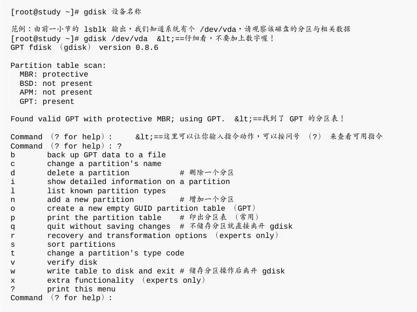

## 7.1.1 磁盘组成与分区的复习

基本上,所有实体磁盘的文件名都已经被仿真成 /dev/sd[a-p] 的格式,第一颗磁盘文件名为 /dev/sda。而分区的文件名若以第一颗磁盘为例,则为	/dev/sda[1-128] 。

除了实体磁盘之外,虚拟机的磁盘通常为 /dev/vd[a-p] 的格式。

若有使用到软件磁盘阵列的话,那还有 /dev/md[0-128] 的磁盘文件名。

使用的是 LVM 时,文件名则为 /dev/VGNAME/LVNAME 等格式。

- `/dev/sd[a-p][1-128]` : 为实体磁盘的磁盘文件名 ;
- `/dev/vd[a-d][1-128]` : 为虚拟磁盘的磁盘文件名 ;

建议过强制使用 GPT 分区喔！ MBR 分区已过时！

## 7.2.1 磁盘与目录的容量

- `df`:列出文件系统的整体磁盘使用量;
- `du`:评估文件系统的磁盘使用量(常用在推估目录所占容量)

### df

先来说明一下范例一所输出的结果讯息为:

- `Filesystem` : 代表该文件系统是在哪个 partition ,所以列出设备名称;
- `1k-blocks` : 说明下面的数字单位是 1KB 呦!可利用 -h 或 -m 来改变容量;
- `Used` : 顾名思义,就是使用掉的磁盘空间啦!
- `Available` : 也就是剩下的磁盘空间大小;
- `Use%` : 就是磁盘的使用率啦!如果使用率高达 90% 以上时, 最好需要注意一下了,免得容量不足造成系统问题喔!(例如最容易被灌爆的	/var/spool/mail	这个放置邮件的磁盘)
- `Mounted on` : 就是磁盘挂载的目录所在啦!(挂载点啦!)

### du

与 df 不一样的是, du 这个指令其实会直接到文件系统内去搜寻所有的文件数据, 所以上述第三个范例指令的运行会执行一小段时间!此外,在默认的情况下,容量的输出是以 KB 来设计的, 如果你想要知道目录占了多少 MB ,那么就使用 -m 这个参数即可啰!而, 如果你只想要知道该目录占了多少容量的话,使用 -s 就可以啦!

至于 -S 这个选项部分,由于 du 默认会将所有文件的大小均列出,因此假设你在 /etc 下面使用 du 时, 所有的文件大小,包括 /etc	 下面的次目录容量也会被计算一次。然后最终的容量 (/etc) 也会加总一次,	因此很多朋友都会误会 du 分析的结果不太对劲。所以啰,如果想要列出某目录下的全部数据, 或许也可以加上 -S	的选项,减少次目录的加总喔!

## 7.2.2 实体链接与符号链接: ln

- Hard	Link (实体链接, 硬式链接或实际链接)

- - 每个文件都会占用一个 inode ,文件内容由	inode 的记录来指向;
- - 想要读取该文件,必须要经过目录记录的文件名来指向到正确的 inode 号码才能读取。

举个例子来说,假设我系统有个 /root/crontab 他是 /etc/crontab 的实体链接,也就是说这两个文件名链接到同一个 inode , 自然这两个文件名的所有相关信息都会一模一样(除了文件名之外)。实际的情况可以如下所示:

你可以发现两个文件名都链接到 34474855 这个 inode 号码,所以您瞧瞧,是否文件的权限/属性完全一样呢?	因为这两个“文件名”其实是一模一样的“文件”啦!而且你也会发现第二个字段由原本的 1 变成 2	了! 那个字段称为“链接”,这个字段的意义为:“有多少个文件名链接到
这个 inode 号码”的意思。 如果将读取到正确数据的方式画成示意图,就类似如下画面:

最大的好处就是“安全”!如同上图中, 如果你将任何一个“文件名”删除,其实 inode 与 block 都还是存在的! 此时你可以通过另一个“文件名”来读取到正确的文件数据喔!此外,不论你使用哪个“文件名”来编辑,	最终的结果都会写入到相同的 inode	与 block	中,因此均能进行数据的修改哩!

由图 7.2.1 其实我们也能够知道,事实上 hard link 应该仅能在单一文件系统中进行的,应该是不能够跨文件系统才对! 因为图	7.2.1 就是在同一个 filesystem	上嘛!所以 hard link	是有限制的:

> 不能跨 Filesystem;

> 不能 link 目录。

不能跨	Filesystem 还好理解,那不能	hard link 到目录又是怎么回事呢?这是因为如果使用 hard link	链接到目录时,	链接的数据需要连同被链接目录下面的所有数据都创建链接,举例来说,如果你要将 /etc 使用实体链接创建一个 /etc_hd 的目录时,那么在 /etc_hd	下面的所有文件名同时都与 /etc 下面的文件名要创建	hard link 的,而不是仅链接到 /etc_hd	与 /etc 而已。

- Symbolic Link (符号链接,亦即是捷径)

由上表的结果我们可以知道两个文件指向不同的 inode	号码,当然就是两个独立的文件存在! 而且链接文件的重要内容就是他会写上目标文件的“文件名”, 你可以发现为什么上表中链接文件的大小为 12 Bytes	呢? 因为箭头(-->)右边的文件名“/etc/crontab”总共有 12 个英文,每个英文占用 1	个 Bytes	,所以文件大小就是 12Bytes 了!

关于上述的说明,我们以如下图示来解释:

知识点汇总实操：

# 7.3 磁盘的分区、格式化、检验与挂载

新增一颗磁盘时：

1.	对磁盘进行分区,以创建可用的 partition ;
2.	对该 partition 进行格式化 (format),以创建系统可用的 filesystem;
3.	若想要仔细一点,则可对刚刚创建好的 filesystem 进行检验;
4.	在 Linux	系统上,需要创建挂载点 (亦即是目录),并将他挂载上来;

## 7.3.1 观察磁盘分区状态

目前磁盘分区主要有 MBR 以及 GPT 两种格式

- lsblk	列出系统上的所有磁盘列表

lsblk 可以看成“	list block device ”的缩写,就是列出所有储存设备的意思!

从上面的输出我们可以很清楚的看到,目前的系统主要有个 sr0 以及一个 vda	的设备,而 vda 的设备下面又有三个分区, 其中 vda3 甚至还有因为 LVM 产生的文件系统!相当的完整吧!从范例一我们来谈谈默认输出的信息有哪些。

- - NAME : 就是设备的文件名啰!会省略 /dev 等前导目录!
- - MAJ:MIN : 其实核心认识的设备都是通过这两个代码来熟悉的!分别是主要:次要设备代码!
- - RM:是否为可卸载设备 (removable	device), 如 光盘、USB 磁盘等等
- - SIZE : 当然就是容量啰!
- - RO : 是否为只读设备的意思
- - MOUTPOINT : 就是前一章谈到的挂载点!

- blkid 列出设备的 UUID 等参数

Linux 会将系统内所有的设备都给予一个独一无二的识别码（UUID）, 这个识别码就可以拿来作为挂载或者是使用这个设备/文件系统之用了。

如上所示,每一行代表一个文件系统,主要列出设备名称、UUID	名称以及文件系统的类型(TYPE)!

- parted 列出磁盘的分区表类型与分区信息

## 7.3.2 磁盘分区: gdisk/fdisk

要注意的是:“MBR 分区表请使用 fdisk 分区,	GPT	分区表请使用 gdisk 分区!”

- gdisk

你应该要通过 `lsblk` 或 `blkid` 先找到磁盘,再用 `parted /dev/xxx print` 来找出内部的分区表类型,之后才用`gdisk`或`fdisk`来操作系统。

使用“ p ”可以列出目前这颗磁盘的分区表信息,这个信息的上半部在显示整体磁盘的状态。以鸟哥这颗磁盘为例,这个磁盘共有 40GB 左右的容量,共有 83886080 个扇区,每个扇区的容量为	512Bytes。 要注意的是,现在的分区主要是以扇区为最小的单位喔!

下半部的分区表信息主要在列出每个分区的个别信息项目。每个项目的意义为:

- - Number : 分区编号,1 号指的是 /dev/vda1 这样计算。
- - Start (sector) : 每一个分区的开始扇区号码位置
- - End	(sector) : 每一个分区的结束扇区号码位置,与 start 之间可以算出分区的总容量
- - Size : 就是分区的容量了
- - Code : 在分区内的可能的文件系统类型。Linux 为 8300,swap 为 8200。不过这个项目只是一个提示而已,不见得真的代表此分区内的文件系统喔!
- - Name : 文件系统的名称等等。

从上表我们可以发现几件事情:

- - 整部磁盘还可以进行额外的分区,因为最大扇区为 83886080,但只使用到 65026047 号
- - 分区的设计中,新分区通常选用上一个分区的结束扇区号码数加 1 作为起始扇区号码!

- 用	gdisk 新增分区

假设我需要有如下的分区需求:

1. 1GB	的 xfs 文件系统 (Linux)
2. 1GB	的 vfat 文件系统 (Windows)
3. 0.5GB 的	swap (Linux	swap)(这个分区等一下会被删除喔!)

重点在“ Last sector ”那一行 , 那行绝对不要使用默认值 ! 因为默认值会将所有的容量用光 ! 因此它默认选择最大的扇区号码! 因为我们仅要 1GB 而已,所以你得要加上 +1G 这样即可!

最终出现的画面会有点像下面这样才对!

如果一切的分区状态都正常的话,那么就直接写入磁盘分区表吧!

- partprobe 更新 Linux 核心的分区表信息

分区表并没有实时更新，可以重启电脑或者使用下面命令：

- 用	gdisk 删除一个分区

让我们将刚刚创建的 /dev/vda6	删除!

Tips 万分注意!不要去处理一个正在使用中的分区!例如,我们的系统现在已经使用了 /dev/vda2 ,那如果你要删除 /dev/vda2 的话,	必须要先将 /dev/vda2 卸载,否则直接删除该分区的话,虽然磁盘还是慧写入正确的分区信息,但是核心会无法更新分区表的信息的! 另外,文件系统与 Linux 系统的稳定性,恐怕也会变得怪怪的!反正!千万不要处理正在使用中的文件系统就对了!

## 7.3.3 磁盘格式化(创建文件系统)

分区完毕后自然就是要进行文件系统的格式化啰!格式化的指令非常的简单,那就是 “make lesystem, mkfs” 这个指令啦!

- XFS 文件系统 mkfs.xfs

- EXT4 文件系统	mkfs.ext4

- 其他文件系统 mkfs

如果要将刚刚的 /dev/vda5 重新格式化为 VFAT 文件系统呢?

## 7.3.4 文件系统检验

如果文件系统真的发生错乱的话,那该如何是好?

- xfs_repair 处理 XFS	文件系统

※修复时该文件系统不能被挂载!

- fsck.ext4	处理 EXT4	文件系统

注意:通常只有身为 root 且你的文件系统有问题的时候才使用这个指令,否则在正常状况下使用此一指令, 可能会造成对系统的危害!

被检查的 partition 务必不可挂载到系统上! 亦即是需要在卸载的状态喔!”

## 7.3.5 文件系统挂载与卸载

挂载点是目录,	而这个目录是进入磁盘分区(其实是文件系统啦!)的入口就是了。

- 单一文件系统不应该被重复挂载在不同的挂载点(目录)中;
- 单一目录不应该重复挂载多个文件系统;
- 要作为挂载点的目录,理论上应该都是空目录才是。

- /etc/filesystems:系统指定的测试挂载文件系统类型的优先顺序;
- /proc/filesystems:Linux系统已经载入的文件系统类型。

我们 Linux 支持的文件系统之驱动程序都写在如下的目录中:

`/lib/modules/$(uname -r)/kernel/fs/`

- 挂载 xfs/ext4/vfat 等文件系统

- 挂载 CD	或 DVD 光盘

- 挂载 vfat 中文U盘 (USB磁盘)

如果带有中文文件名的数据,那么可以在挂载时指定一下挂载文件系统所使用的语系数据。在 man mount	找到 vfat	文件格式当中可以使用	codepage 来处理!中文语系的代码为 950 喔!另外,如果想要指定中文是万国码还是大五码, 就得要使用 iocharset 为	utf8 还是	big5两者择一了!因为鸟哥的U盘使用	utf8 编码,因此将上述的 big5	前面加上 # 符号

万一你使用的 USB	磁盘被格式化为	NTFS 时,那可能就得要动点手脚,因为默认的	CentOS7	并没有支持 NTFS 文件系统格式!	所以你得要安装	NTFS 文件系统的驱动程序后,才有办法处理的!

- 重新挂载根目录与挂载不特定目录

整个目录树最重要的地方就是根目录了,所以根目录根本就不能够被卸载的!问题是,如果你的挂载参数要改变,	或者是根目录出现“只读”状态时,如何重新挂载呢?最可能的处理方式就是重新开机	(reboot)!	不过你也可以这样做:

另外,我们也可以利用 mount 来将某个目录挂载到另外一个目录去喔!

- umount (将设备文件卸载)

# 7.4 设置开机挂载

## 7.4.1 开机挂载 /etc/fstab 及 /etc/mtab

- 根目录 /	是必须挂载的,而且一定要先于其它 mount point 被挂载进来。
- 其它 mount point 必须为已创建的目录,可任意指定,但一定要遵守必须的系统目录架构原则 (FHS)
- 所有 mount point 在同一时间之内,只能挂载一次。
- 所有 partition 在同一时间之内,只能挂载一次。
- 如若进行卸载,您必须先将工作目录移到 mount point(及其子目录) 之外。

- 第一栏 : 磁盘设备文件名/UUID/LABEL name : 这个字段可以填写的数据主要有三个项目:
- - 文件系统或磁盘的设备文件名,如	/dev/vda2 等
- - 文件系统的 UUID 名称, 如 UUID=xxx
- - 文件系统的 LABEL 名称,例如 LABEL=xxx
- 第二栏 : 挂载点 (mount point)::
- 第三栏 : 磁盘分区的文件系统:
- 第四栏 : 文件系统参数:
- - 
- 第五栏:能否被 dump 备份指令作用: dump 是一个用来做为备份的指令,不过现在有太多的备份方案了,所以这个项目可以不要理会啦!直接输入 0	就好了!
- 第六栏:是否以 fsck 检验扇区: 直接填 0 就好了

例题:假设我们要将 /dev/vda4	每次开机都自动挂载到 /data/xfs ,该如何进行?

答:首先, 如果已经用命令挂载了，先卸载！接着，请用 nano 将下面这一行写入 /etc/fstab 最后面中;

最后测试一下刚刚我们写入 /etc/fstab	的语法有没有错误!这点很重要!因为这个文件如果写错了,	则你的	Linux 很可能将无法顺利开机完成!所以请务必要测试测试喔!

最终有看到 /dev/vda4	被挂载起来的信息才是成功的挂载了!

## 7.4.2 特殊设备 loop 挂载 (镜像文件不烧录就挂载使用)

- 挂载光盘/DVD镜像文件

如此一来我们不需要将这个文件烧录成为光盘或者是	DVD	就能够读取内部的数据了!

# 7.7 重点回顾

- 一个可以被挂载的数据通常称为“文件系统, filesystem”而不是分区 (partition)	喔!
- 基本上 Linux	的传统文件系统为 Ext2 ,该文件系统内的信息主要有:
- - superblock:记录此 filesystem 的整体信息,包括 inode/block 的总量、使用量、剩余量,	以及文件系统的格式与相关信息等;
- - inode:记录文件的属性,一个文件占用一个 inode ,同时记录此文件的数据所在的 block 号码;
- - block:实际记录文件的内容,若文件太大时,会占用多个 block 。
- Ext2 文件系统的数据存取为索引式文件系统(indexed allocation)
- 需要磁盘重组的原因就是文件写入的 block 太过于离散了,此时文件读取的性能将会变的很差所致。 这个时候可以通过磁盘重组将同一个文件所属的 blocks	汇整在一起
- Ext2文件系统主要有:boot sector, superblock, inode bitmap, block bitmap, inode table,data	block 等六大部分。
- data block 是用来放置文件内容数据地方,在 Ext2 文件系统中所支持的 block 大小有1K, 2K	及 4K 三种而已
- inode	记录文件的属性/权限等数据,其他重要项目为: 每个 inode	大小均为固定,有 128/256Bytes 两种基本容量。每个文件都仅会占用一个 inode 而已;	因此文件系统能够创建的文件数量与 inode 的数量有关;
- 文件的 block	在记录文件的实际数据,目录的 block 则在记录该目录下面文件名与其inode	号码的对照表;
- 日志式文件系统 (journal) 会多出一块记录区,随时记载文件系统的主要活动,可加快系统复原时间;
- Linux	文件系统为增加性能,会让内存作为大量的磁盘高速缓存;
- 实体链接只是多了一个文件名对该 inode	号码的链接而已;
- 符号链接就类似Windows的捷径功能。
- 磁盘的使用必需要经过:分区、格式化与挂载,分别惯用的指令为:gdisk, mkfs, mount三个指令
- 分区时,应使用 parted 检查分区表格式,再判断使用 fdisk/gdisk 来分区,或直接使用 parted 分区
- 为了考虑性能,XFS 文件系统格式化时,可以考虑加上 agcount/su/sw/extsize 等参数较佳
- 如果磁盘已无未分区的容量,可以考虑使用大型文件取代磁盘设备的处理方式,通过	dd 与格式化功能。
- 开机自动挂载可参考/etc/fstab之设置,设置完毕务必使用 mount -a 测试语法正确否;

# 7.8 本章习题 - 第一题一定要做

- 情境仿真题一:复原本章的各例题练习,本章新增非常多	partition	,请将这些	partition 删除,恢复到原本刚安装好时的状态。

1. 目标:了解到删除分区需要注意的各项信息;
2. 前提:本章的各项范例练习你都必须要做过,才会拥有	/dev/vda4	~	/dev/vda7	出现;
3. 需求:熟悉	gdisk,	parated,	umount,	swapoff	等指令。	由于本章处理完毕后,将会有许多新增的	partition	,所以请删除掉这两个	partition	。删除的过程需要注意的是:
4. 需先以 free	/	swapon	-s	/	mount	等指令查阅,要被处理的文件系统不可以被使用!如果有被使用,则你必须要使用	umount	卸载文件系统。如果是内存交换空间,则需使用	swapon	-s	找出被使用的分区,	再以	swapoff	去卸载他!

5. 观察 /etc/fstab ,该文件新增的行全部删除或注解!

6. 使用“ gdisk /dev/vda ”删除,也可以使用“ parted	/dev/vda rm	号码”删除喔!

- 情境仿真题二:由于我的系统原本分区的不够好,我的用户希望能够独立一个	filesystem 附挂在	/srv/myproject	目录下。	那你该如何创建新的	filesystem	,并且让这个	filesystem 每次开机都能够自动的挂载到	/srv/myproject	,	且该目录是给	project	这个群组共享的,其他人不可具有任何权限。且该	filesystem	具有	1GB	的容量。

1. 目标:理解文件系统的创建、自动挂载文件系统与专案开发必须要的权限;
2. 前提:你需要进行过第六章的情境仿真才可以继续本章;
3. 需求:本章的所有概念必须要清楚!	那就让我们开始来处理这个流程吧!
4. 首先,我们必须要使用	gdisk	/dev/vda	来创建新的	partition。	然后按下“	n	”,按下“Enter”选择默认的分区号码,再按“Enter”选择默认的启始柱面,	按下“+1G”创建1GB	的磁盘分区,再按下“Enter”选择默认的文件系统	ID。	可以多按一次“p	”看看是否正确,若无问题则按下“w”写入分区表;
5. 避免重新开机,因此使用“	partprobe	”强制核心更新分区表;
6. 创建完毕后,开始进行格式化的动作如下:“mkfs.xfs	-f	/dev/vda4”,这样就	OK	了!
7. 开始创建挂载点,利用:“	mkdir	/srv/myproject	”来创建即可;
8. 编写自动挂载的配置文件:“	nano	/etc/fstab	”,这个文件最下面新增一行,内容如下:	/dev/vda4	/srv/myproject	xfs	defaults	0	0
9. 测试自动挂载:“	mount	-a	”,然后使用“	df	/srv/myproject	”观察看看有无挂载即可!
10. 设置最后的权限,使用:“	chgrp	project	/srv/myproject	”以及“	chmod	2770 /srv/myproject	”即可。

简答题部分:

- 我们常常说,开机的时候,“发现磁盘有问题”,请问,这个问题的产生是“filesystem	的损毁”,还是“磁盘的损毁”?

特别需要注意的是,如果您某个	filesystem	里面,由于操作不当,可能会造成	Superblock	数据的损毁,	或者是	inode	的架构损毁,或者是	block	area的记录遗失等等,这些问题当中,其实您的“磁盘”还是好好的,	不过,在磁盘上面的“文件系统”则已经无法再利用!一般来说,我们的	Linux	很少会造成	filesystem	的损毁,	所以,发生问题时,很可能整个磁盘都损毁了。但是,如果您的主机常常不正常断电,那么,	很可能磁盘是没问题的,但是,文件系统则有损毁之虞。此时,重建文件系统(reinstall)	即可!	不需要换掉磁盘啦!	^_^

- 当我有两个文件,分别是	file1	与	file2	,这两个文件互为	hard	link	的文件,请问,	若我将	file1	删除,然后再以类似	vi	的方式重新创建一个名为	file1	的文件,	则	file2	的内容是否会被更动?

当我删除	file1	之后,	file2	则为一个正规文件,并不会与他人共同分享同一个	inode	与	block	,因此,当我重新创建一个文件名为	file1时,他所利用的	inode	与	block	都是由我们的	filesystem	主动去搜寻	meta	data	,找到空的	inode	与	block	来创建的,	与原本的	file1	并没有任何关连性喔!所以,新建的	file1	并不会影响	file2	呢!

