## 5.2.1 文件属性

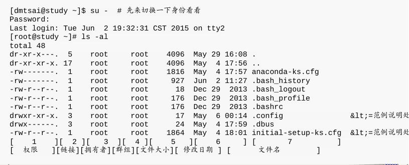

使用	`su	-`	这个指令来切换身份喔!

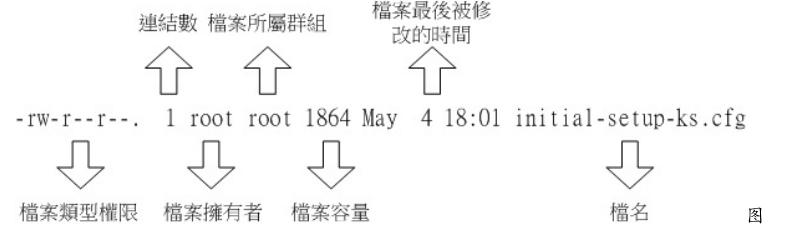

- 第一栏代表文件的类型与权限

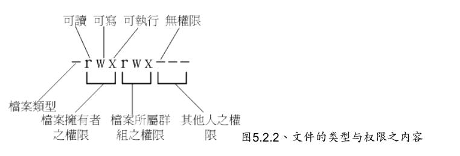

> -  第一个字符代表这个文件是“目录、文件或链接文件等等”:
> - - 当为[	d	]则是目录,例如上表文件名为“.config”的那一行;
> - - 当为[	-	]则是文件,例如上表文件名为“initial-setup-ks.cfg”那一行;
> - - 若是[	l	]则表示为链接文件(link	file);
> - - 若是[	b	]则表示为设备文件里面的可供储存的周边设备(可随机存取设备);
> - - 若是[	c	]则表示为设备文件里面的序列埠设备,例如键盘、鼠标(一次性读取设备)。
>
> - 接下来的字符中,以三个为一组,且均为“rwx”	的三个参数的组合。其中,[	r	]代表可读(read)、[	w	]代表可写(write)、[	x	]代表可执行(execute)。	要注意的是,这三个权限的位置不会改变,如果没有权限,就会出现减号[	-	]而已。
> - - 第一组为“文件拥有者可具备的权限”,以“initial-setup-ks.cfg”那个文件为例,	该文件的拥有者可以读写,但不可执行;
> - - 第二组为“加入此群组之帐号的权限”;
> - - 第三组为“非本人且没有加入本群组之其他帐号的权限”。

- 第二栏表示有多少文件名链接到此节点(i-node)

- 第三栏表示这个文件(或目录)的“拥有者帐号”

- 第四栏表示这个文件的所属群组

- 第五栏为这个文件的容量大小,默认单位为Bytes;

- 第六栏为这个文件的创建日期或者是最近的修改日期:

> - 如果想要显示完整的时间格式,可以利用ls的选项,亦即:“ls	-l	--full-time”就能够显示出完整的时间格式了!包括年、月、日、时间喔。

- 第七栏为这个文件的文件名

## 5.2.2	如何改变文件属性与权限

几个常用于群组、拥有者、各种身份的权限之修改的指令,如下所示:

- `chgrp`	:改变文件所属群组
- `chown`	:改变文件拥有者
- `chmod`	:改变文件的权限,	SUID,	SGID,	SBIT等等的特性

### 改变所属群组：`chgrp`

这个指令就是change group的缩写嘛!要被改变的群组名称必须要在`/etc/group`文件内存在才行,否则就会显示错误!

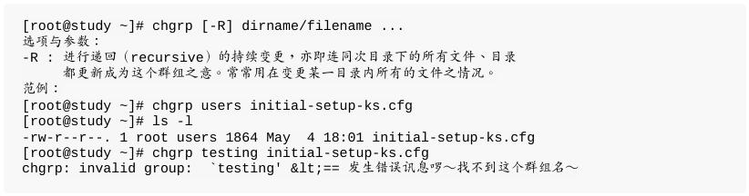

### 改变文件拥有者：`chown`

是change	owner的缩写!要注意的是,	使用者必须是已经存在系统中的帐号,也就是在`/etc/passwd`这个文件中有纪录的使用者名称才能改变。

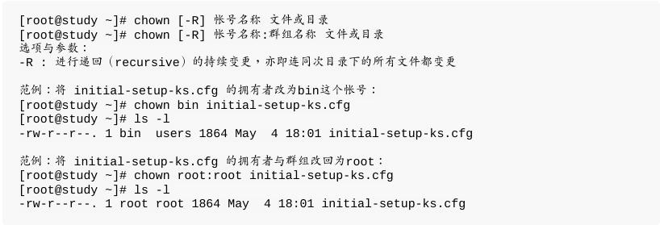

### 改变权限：`chmod`

- 数字类型改变文件权限

使用数字来代表各个权限,各权限的分数对照表如下:

`>	r:4	>	w:2	>	x:1`

每种身份(owner/group/others)各自的三个权限(r/w/x)分数是需要累加的,例如当权限为:	[-rwxrwx---]	分数则是:

`>	owner	=	rwx	=	4+2+1	=	7	>	group	=	rwx	=	4+2+1	=	7	>	others=	---	=	0+0+0	=	0`

所以等一下我们设置权限的变更时,该文件的权限数字就是770啦!变更权限的指令chmod的语法是这样的:

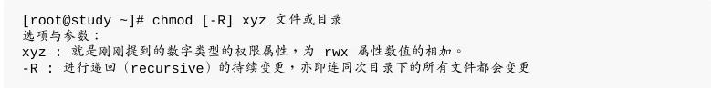

举例来说,如果要将.bashrc这个文件所有的权限都设置启用,那么就下达:

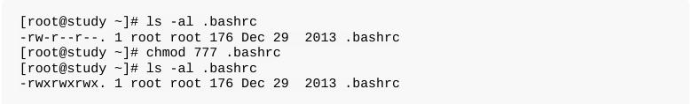

- 符号类型改变文件权限

基本上就九个权限分别是`(1)user	(2)group	(3)others`三种身份啦!那么我们就可以借由`u,	g,	o`来代表三种身份的权限!此外,	a	则代表	all	亦即全部的身份!那么读写的权限就可以写成r,	w,	x!也就是可以使用下面的方式来看:

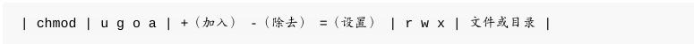

来实作一下吧!假如我们要“设置”一个文件的权限成为“-rwxr-xr-x”时,基本上就是:

> user	(u):具有可读、可写、可执行的权限;
> group	与	others	(g/o):具有可读与执行的权限。	所以就是:

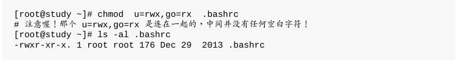

如果我不知道原先的文件属性,而我只想要增加.bashrc这个文件的每个人均可写入的权限,	那么我就可以使用:

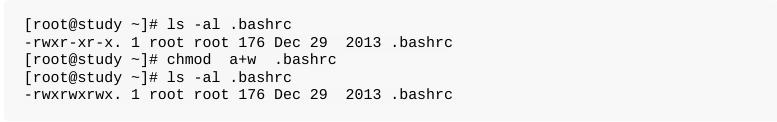

而如果是要将权限去掉而不更动其他已存在的权限呢?例如要拿掉全部人的可执行权限,则:

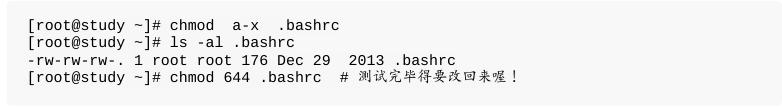

## 5.2.3	目录与文件之权限意义:

### 权限对文件的重要性

- r	(read):可读取此一文件的实际内容,如读取文本文件的文字内容等;
- w	(write):可以编辑、新增或者是修改该文件的内容(**但不含删除该文件**);
- x	(execute):该文件具有可以被系统执行的权限。

在Linux下面,我们的文件是否能被执行,则是借由是否具有“x”这个权限来决定的!跟文件名是没有绝对的关系的!

### 权限对目录的重要性

目录主要的内容在记录文件名清单,文件名与目录有强烈的关连啦!

- r	(read	contents	in	directory):

- - 表示具有读取目录结构清单的权限,所以当你具有读取(r)一个目录的权限时,表示你可以查询该目录下的文件名数据。	所以你就可以利用	`ls`这个指令将该目录的内容列表显示出来!
- w	(modify	contents	of	directory):

- - 这个可写入的权限对目录来说,是很了不起的!	因为他表示你具有异动该目录结构清单的权限,也就是下面这些权限:

- - 1、创建新的文件与目录，`mkdir`,`touch`,`vi`;
- - 2、删除已经存在的文件与目录(不论该文件的权限为何!),`rm`
- - 3、将已存在的文件或目录进行更名,;
- - 4、搬移该目录内的文件、目录位置,`mv`。
- - 5、总之,目录的w权限就与该目录下面的文件名异动有关就对了啦!

- x	(access	directory):

- - 目录的x代表的是使用者能否进入该目录成为工作目录的用途!。而变换目录的指令是`“cd”(changedirectory)`啰!

### 总结

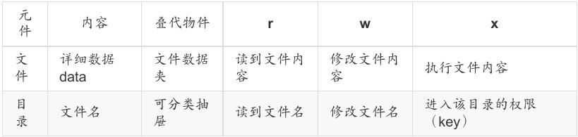

对`一般文件`来说,rwx	主要是针对`“文件的内容”`来设计权限,对`目录`来说,rwx则是针对`“目录内的文件名列表”`来设计权限。

我们来处理个特殊的案例!假设两个文件名,分别是下面这样:

>/dir1/file1
>
>/dir2

假设你现在在系统使用	dmtsai	这个帐号,那么这个帐号针对	/dir1,	/dir1/file1,	/dir2	这三个文件名来说,分别需要`“哪些最小的权限”`才能达成各项任务?

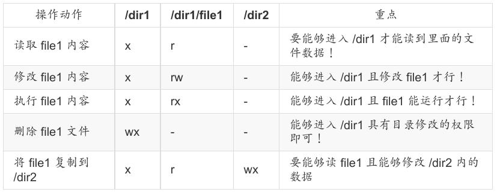

上面的表格当中,很多时候	/dir1	都不必有	r	耶!为啥?

我们知道	/dir1	是个目录,也是个抽屉!那个抽屉的	r	代表“这个抽屉里面有灯光”,	所以你能看到的抽屉内的所有数据夹名称	(非内容)。但你已经知道里面的数据夹放在哪个地方,那,有没有灯光有差嘛?你还是可以摸黑拿到该数据夹的!对吧!	因此,上面很多动作中,你只要具有	x	即可!`r	是非必备的!只是,没有	r	的话,使用	[tab]	时,他就无法自动帮你补齐文件名了`!

**※※要读一个文件时,你得要具有“这个文件所在目录的	x 权限”才行!所以,通常要开放的目录,	至少会具备	rx	这两个权限!**

## 5.2.4	Linux文件种类与扩展名

文件种类:

- 正规文件(regular	file):	就是一般我们在进行存取的类型的文件,在由	ls	-al	所显示出来的属性方面,第一个字符为	[	-	],例如	[-rwxrwxrwx	]。另外,依照文件的内容,又大略可以分为:

- - 纯文本文件(ASCII)
- - 二进制档(binary)
- - 二进制档(binary)

- 目录(directory):	就是目录啰~第一个属性为	[	d	],例如	[drwxrwxrwx]。

- 链接文件(link):	就是类似Windows系统下面的捷径啦!	第一个属性为	[	l	](英文L的小写),例如[lrwxrwxrwx];

- 设备与设备文件(device):	与系统周边及储存等相关的一些文件,	通常都集中在/dev这个目录之下!通常又分为两种:

- - 区块(block)设备文件：硬盘与软盘等就是啦!现第一个属性为[	b	]喔!
- - 字符(character)设备文件:	例如键盘、鼠标等。!第一个属性为	[	c	]。

- 数据接口文件(sockets):	第一个属性为	[	s	],	最常在/run或/tmp这些个目录中看到这种文件类型了。

- 数据输送档(FIFO,	pipe):	FIFO是first-in-first-out的缩写。第一个属性为[p]	。

## 5.3.2	目录树(directory	tree)

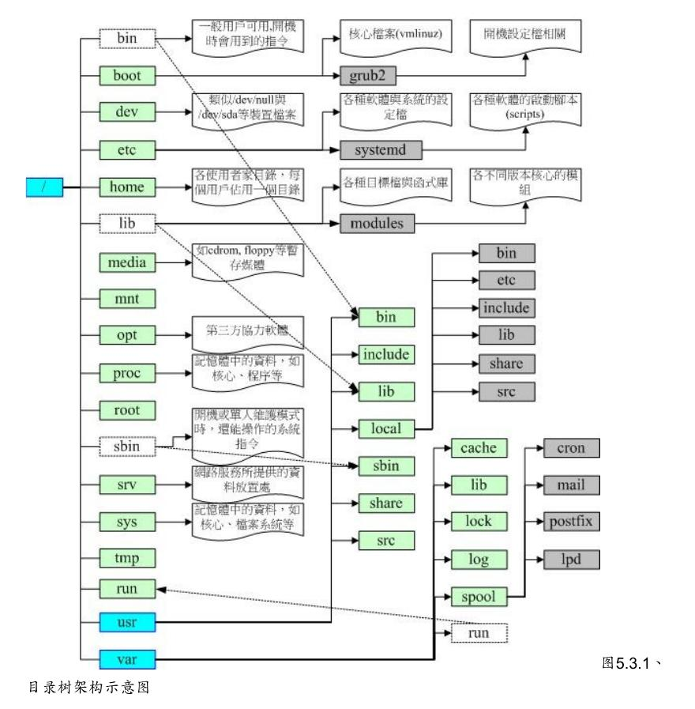

根据FHS的定义,你最好能够将`/var`独立出来,	这样对于系统的数据还有一些安全性的保护呢!因为至少/var死掉时,你的根目录还会活着嘛!	还能够进入救援模式啊!

## 5.4	重点回顾

- Linux的每个文件中,可分别给予使用者、群组与其他人三种身份个别的	rwx	权限;

- 群组最有用的功能之一,就是当你在团队开发资源的时候,且每个帐号都可以有多个群组的支持;

- 利用ls	-l显示的文件属性中,第一个字段是文件的权限,共有十个位,第一个位是文件类型,	接下来三个为一组共三组,为使用者、群组、其他人的权限,权限有r,w,x三种;

- 如果文件名之前多一个“	.	”,则代表这个文件为“隐藏文件”;

- 若需要root的权限时,可以使用	su	-	这个指令来切换身份。处理完毕则使用	exit	离开	su的指令环境。

- 更改文件的群组支持可用chgrp,修改文件的拥有者可用chown,修改文件的权限可用chmod

- chmod chmod修改权限的方法有两种,分别是符号法与数字法,数字法中r,w,x分数为4,2,1;

- 对文件来讲,权限的性能为:
- - r:可读取此一文件的实际内容,如读取文本文件的文字内容等;
- - w:可以编辑、新增或者是修改该文件的内容(但不含删除该文件);
- - x:该文件具有可以被系统执行的权限。

- 对目录来说,权限的性能为:
- - r	(read	contents	in	directory)
- - w	(modify	contents	of	directory)
- - x	(access	directory)

- 要开放目录给任何人浏览时,应该至少也要给予r及x的权限,但w权限不可随便给;

- 能否读取到某个文件内容,跟该文件所在的目录权限也有关系	(目录至少需要有	x	的权限)。

- Linux文件名的限制为:单一文件或目录的最大容许文件名为	255	个英文字符或	128	个中文字符;

- 根据FHS的官方文件指出,	他们的主要目的是希望让使用者可以了解到已安装软件通常放置于那个目录下

- FHS订定出来的四种目录特色为:shareable,	unshareable,	static,	variable等四类;

- FHS所定义的三层主目录为:/,	/var,	/usr三层而已;

- 绝对路径文件名为从根目录	/	开始写起,否则都是相对路径的文件名。

## 5.5	本章练习

- 早期的	Unix	系统文件名最多允许	14	个字符,而新的	Unix	与	Linux	系统中,文件名最多可以容许几个字符?
> 由于使用Ext2/Ext3/Ext4/xfs	文件系统,单一文件名可达	255	字符

- 当一个一般文件权限为	-rwxrwxrwx	则表示这个文件的意义为?
> 任何人皆可读取、修改或编辑、可以执行,但不一定能删除。

- 我需要将一个文件的权限改为	-rwxr-xr--	请问该如何下达指令?
> chmod	754	filename	或 chmod	u=rwx,g=rx,o=r	filename

- 若我需要更改一个文件的拥有者与群组,该用什么指令?
> chown,	chgrp

- 请问下面的目录与主要放置什么数据:	/etc/,	/boot,	/usr/bin,	/bin,	/usr/sbin,	/sbin,	/dev,/var/log,	/run

> /etc/:几乎系统的所有设置文件均在此,尤其passwd,shadow
>
> /boot:开机配置文件,也是默认摆放核心	vmlinuz	的地方
>
> /usr/bin,/bin:一般可执行文件摆放的地方
>
> /usr/sbin,/sbin:系统管理员常用指令集
>
> /dev:摆放所有系统设备文件的目录
>
> /var/log:摆放系统登录文件的地方
>
> /run:CentOS7以后才有,将经常变动的项目(每次开机都不同,如程序的PID)移动到内存暂存,所以/run并不占实际磁盘容量

- 若一个文件的文件名开头为“	.	”,例如	.bashrc	这个文件,代表什么?另外,如何显示出这个文件名与他的相关属性?
> 有 “.” 为开头的为隐藏文件,需要使用 ls	-a 这个 -a 的选项这个文件名与他的相关属性?有 “.” 为开头的为隐藏文件,需要才能显示出隐藏文件的内容,而使用	ls	-al	才能显示出属性。

