# 8.2 Linux 系统常见的压缩指令

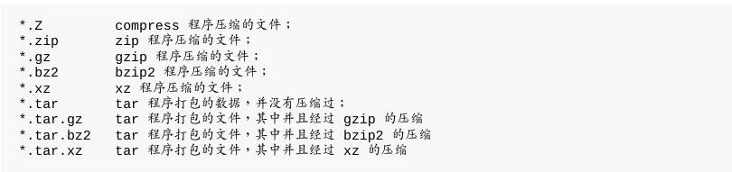

## 8.2.1 gzip, zcat/zmore/zless/zgrep

gzip 可以说是应用度最广的压缩指令了!目前	gzip 可以解开 compress,	zip	与 gzip 等软件所压缩的文件。

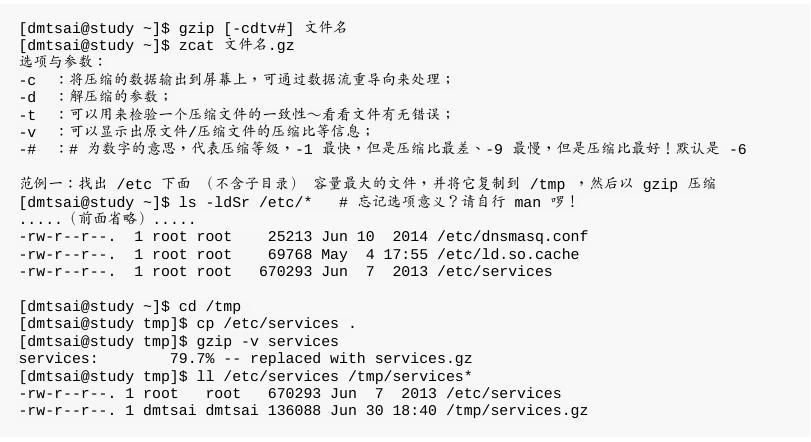

当你使用 gzip 进行压缩时,在默认的状态下原本的文件会被压缩成为 .gz	的文件名,原始文件就不再存在了。此外,使用 gzip 压缩的文件在 Windows 系统中,竟然可以被 WinRAR/7zip 这个软件解压缩呢!很好用吧!

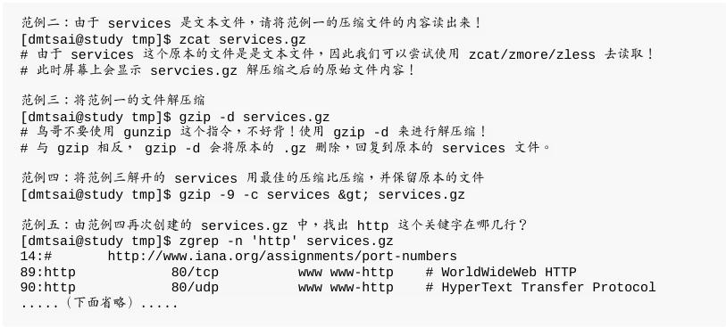

使用默认的 6 就非常好用了!	因此上述的范例四可以不要加入那个	-9	的选项。范例四的重点在那个 -c 与 >	的使用啰! -c 可以将原本要转成压缩文件的数据内容,将它变成文字类型从屏幕输出, 然后我们可以通过大于 (>) 这个符号,将原本应该由屏幕输出的数据,转成输出到文件而不是屏幕,所以就能够创建出压缩挡了。

## 8.2.2 bzip2,	bzcat/bzmore/bzless/bzgrep

gzip 是为了取代 compress	并提供更好的压缩比而成立的,那么 bzip2 则是为了取代 gzip 并提供更佳的压缩比而来的。

这玩意的压缩比竟然比 gzip 还要好~至于 bzip2 的用法几乎与 gzip 相同!

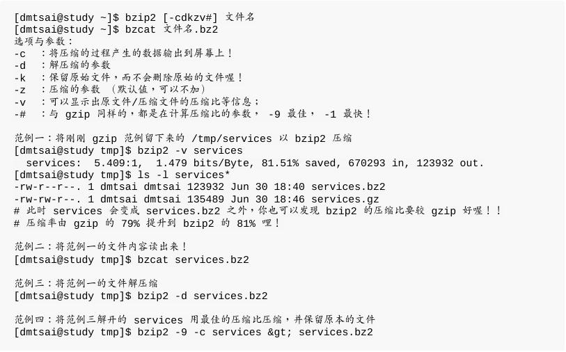

你会发现到 bzip2	连选项与参数都跟 gzip 一模一样!只是扩展名由 .gz 变成 .bz2 而已!

## 8.2.3 xz, xzcat/xzmore/xzless/xzgrep

虽然 bzip2 已经具有很棒的压缩比,不过显然某些自由软件开发者还不满足,因此后来还推出了 xz 这个压缩比更高的软件!这个软件的用法也跟 gzip/bzip2 几乎一模一样!

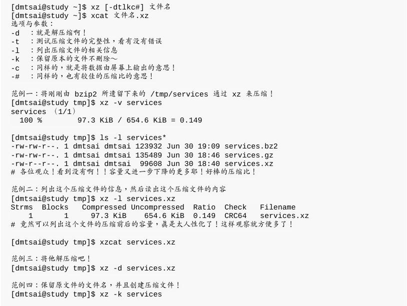

不过, xz最大的问题是...时间花太久了! 多花十倍的时间...如果时间是你的重要成本,那么 gzip 恐怕是比较适合的压缩软件喔!

# 8.3 打包指令: tar

由于 tar 的使用太广泛了,目前 Windows 的 WinRAR 也支持	 tar.gz 文件名的解压缩呢!

## 8.3.1 tar

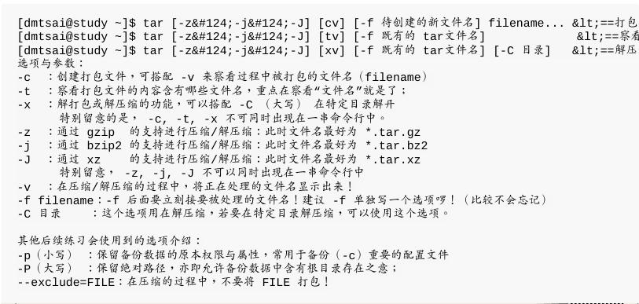

其实最简单的使用 tar 就只要记忆下面的方式即可:

- 压 缩 : `tar -jcv -f filename.tar.bz2 要被压缩的文件或目录名称`
- 查 询 : `tar -jtv -f filename.tar.bz2`
- 解压缩 : `tar -jxv -f filename.tar.bz2 -C	欲解压缩的目录`

建议您在学习 tar 时,将“ -f filename ”与其他选项独立出来,会比较不容易发生问题。

- 使用 tar 加入	-z,	-j 或 -J	的参数备份 /etc/	目录

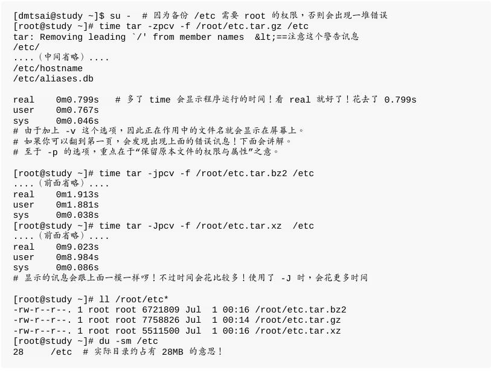

xz压缩比最高，但时间也最长！加上“	-p	”这个选项的原因是为了保存原本文件的权限与属性!

- 查阅 tar 文件的数据内容 (可察看文件名),与备份文件名有否根目录的意义

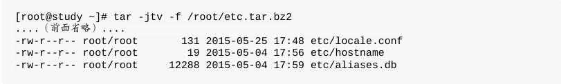

每个文件名都没了根目录了!这也是上一个练习中出现的那个警告讯息“tar: Removing leading 	/' from	member names(移除了文件名开头的 /' )”所告知的情况!

那为什么要拿掉根目录呢?

主要是为了安全!我们使用 tar 备份的数据可能会需要解压缩回来使用,	在 tar 所记录的文件名 (就是我们刚刚使用 tar	-jtvf 所察看到的文件名)	那就是解压缩后的实际文件名。 如果拿掉了根目录,假设你将备份数据在 /tmp 解开,那么解压缩的文件名就会变成“/tmp/etc/xxx”。	但“如果没有拿掉根目录,解压缩后的文件名就会是绝对路径, 亦即解压缩后的数据一定会被放置到 /etc/xxx	去!”如此一来,你的原本的 /etc/ 下面的数据, 就会被备份数据所覆盖过去了!

- 将备份的数据解压缩,并考虑特定目录的解压缩动作 (-C 选项的应用)

指定欲解开的目录，可以使用 -C 这个选项喔!

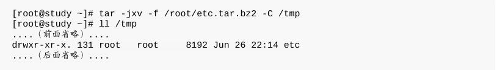

- 仅解开单一文件的方法

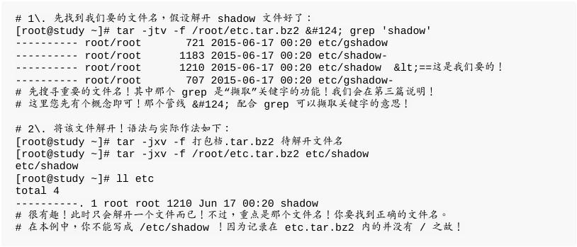

- 打包某目录,但不含该目录下的某些文件之作法

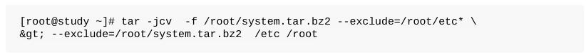

通过这个 --exclude="file" 的动作,我们可以将几个特殊的文件或目录移除在打包之列

- 仅备份比某个时刻还要新的文件

备份新的文件而已,并不想要备份旧文件!

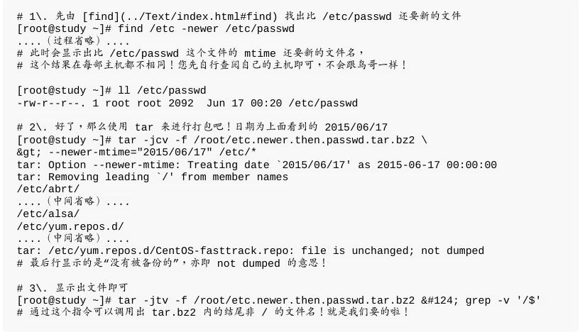

- 例题:系统备份范例

系统上有非常多的重要目录需要进行备份,而且其实我们也不建议你将备份数据放置到	/root 目录下!	假设目前你已经知道重要的目录有下面这几个:
>/etc/ (配置文件)
>
>/home/	(使用者的主文件夹)
>
>/var/spool/mail/ (系统中,所有帐号的邮件信箱)
>
>/var/spool/cron/ (所有帐号的工作排成配置文件)
>
>/root (系统管理员的主文件夹)

/home/loop*	不需要备份,而且 /root 下面的压缩文件也不需要备份,另外假设你要将备份的数据放置到 /backups ,并且该目录仅有	root	有权限进入!	此外,每次备份的文件名都希望不相同,例如使用:backup-system-20150701.tar.bz2	之类的文件名来处理。	那你该如何处理这个备份数据呢?

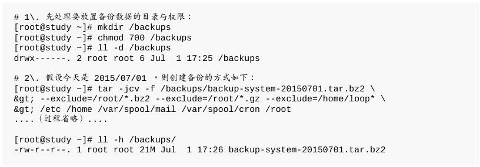

## 解压缩后的 SELinux 课题

复原完毕之后,无论如何就是无法正常的登陆系统!大部分原因就是因为 /etc/shadow 这个密码文件的 SELinux 类型在还原时被更改了!导致系统的登陆程序无法顺利的存取它

简单的处理方式有这几个:

- 通过各种可行的救援方式登陆系统,然后修改 /etc/selinux/config 文件,将	SELinux	改成 permissive 模式,重新开机后系统就正常了;
- 在第一次复原系统后,不要立即重新开机!先使用 restorecon	-Rv	/etc 自动修复一下 SELinux 的类型即可。
- 通过各种可行的方式登陆系统,创建 /.autorelabel 文件,重新开机后系统会自动修复 SELinux 的类型,并且又会再次重新开机,之后就正常了!

鸟哥个人是比较偏好第 2 个方法,不过如果忘记了该步骤就重新开机呢?那鸟哥比较偏向使用第 3 个方案来处理,这样就能够解决复原后的	SELinux	问题啰!

