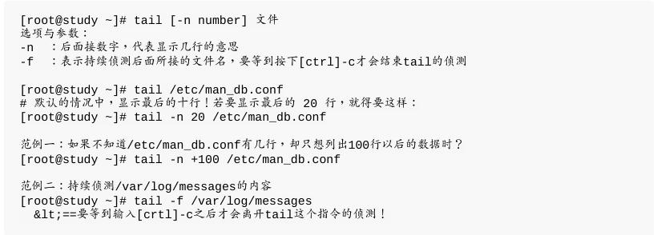
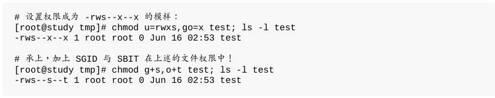
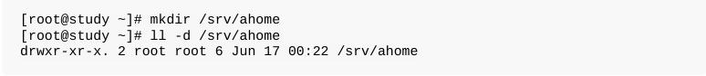

## 6.1.2 目录的相关操作

特殊的目录：

谈几个常见的处理目录的指令:

- cd	(change	directory,	变换目录)

- pwd	(显示目前所在的目录)

- mkdir	(创建新目录)

- rmdir	(删除“空”的目录)

那如果要将所有目录下的东西都杀掉呢(非空)?!	这个时候就必须使用`rm -r	test`啰!不过,还是使用	rmdir	比较不危险!

## 6.1.3	关于可执行文件路径的变量:	$PATH

就将/root加入PATH当中，加入的方法很简单：

## 6.2.1	文件与目录的检视:	ls

下面是一些常用的范例：

## 6.2.2	复制、删除与移动:	cp,	rm,	mv

- cp	(复制文件或目录)

下面是一些常用的范例：

在默认的条件中,cp的来源文件与目的文件的权限是不同的,目的文件的拥有者通常会是指令操作者本身。

由于具有这个特性,因此当我们在进行备份的时候,某些需要特别注意的特殊权限文件,	例如密码档(/etc/shadow)	以及一些配置文件,就不能直接以	cp	来复制,而必须要加上	-a或者是	-p	等等可以完整复制文件权限的选项才行!另外,如果你想要复制文件给其他的使用者,	也必须要注意到文件的权限(包含读、写、执行以及文件拥有者等等),	否则,其他人还是无法针对你给予的文件进行修订的动作喔!注意注意!

范例四可有趣了!使用	-l	及	-s	都会创建所谓的链接文件(link	file),但是这两种链接文件却有不一样的情况。这是怎么一回事啊?	那个	-l	就是所谓的实体链接(hard	link),至于	-s	则是符号链接(symbolic	link),	简单来说,bashrc_slink	是一个“捷径”,这个捷径会链接到bashrc去!所以你会看到文件名右侧会有个指向(->)的符号!

至于bashrc_hlink文件与bashrc的属性与权限完全一模一样,与尚未进行链接前的差异则是第二栏的link数由1变成2了!

例题:你能否使用	dmtsai	的身份,完整的复制/var/log/wtmp文件到/tmp下面,并更名为dmtsai_wtmp呢?答

由于	dmtsai	的身份并不能随意修改文件的拥有者与群组,因此虽然能够复制wtmp的相关权限与时间等属性,	但是与拥有者、群组相关的,原本	dmtsai	身份无法进行的动作,即使加上	-a	选项,也是无法达成完整复制权限的!

总之,由于	cp	有种种的文件属性与权限的特性,所以,在复制时,你必须要清楚的了解到:

> 是否需要完整的保留来源文件的信息?
>
> 来源文件是否为链接文件	(symbolic	link	file)?
>
> 来源文件是否为特殊的文件,例如	FIFO,	socket	等?
>
> 来源文件是否为目录?

- rm	(移除文件或目录)

- mv	(移动文件与目录,或更名)

## 6.2.3	取得路径的文件名称与目录名称

# 6.3	文件内容查阅

- cat	由第一行开始显示文件内容
- tac	从最后一行开始显示,可以看出	tac	是	cat	的倒着写!
- nl	显示的时候,顺道输出行号!
- more	一页一页的显示文件内容
- less	与	more	类似,但是比	more	更好的是,他可以往前翻页!
- head	只看头几行
- tail	只看尾巴几行
- od	以二进制的方式读取文件内容!

## 6.3.1	直接检视文件内容

- cat	(concatenate)

- tac	(反向列示)

- nl	(添加行号打印)

## 6.3.2	可翻页检视

- more	(一页一页翻动)

- less	(一页一页翻动)

可以输入的指令有:

> 空白键 : 向下翻动一页;
>
> [pagedown] : 向下翻动一页;
>
> [pageup] : 向上翻动一页;
>
> /字串 : 向下搜寻“字串”的功能;
>
> ?字串 : 向上搜寻“字串”的功能;
>
> n : 重复前一个搜寻 (与 / 或 ? 有关!)
>
> N : 反向的重复前一个搜寻 (与 / 或 ? 有关!)
>
> g	: 前进到这个数据的第一行去;
>
> G	: 前进到这个数据的最后一行去	(注意大小写);
>
> q	: 离开 less 这个程序;

## 6.3.3	数据撷取

要注意的是,`head`与`tail`都是以“行”为单位来进行数据撷取的喔!

- head	(取出前面几行)

另外那个 -n 选项后面的参数较有趣,如果接的是负数,例如上面范例的`-n -100`时,代表列前的所有行数,	但不包括后面100行。

举例来说 CentOS 7.1	的 /etc/mandb.conf 共有131行,则上述的指令“head -n	-100 /etc/man_db.conf”	就会列出前面31行,后面100行不会打印出来.

- tail	(取出后面几行)

当下达 “`tail -n +100 /etc/man_db.conf`” 代表该文件从100行以后都会被列出来，同样的，在man_db.conf共有131行,因此第100~131行就会被列出来啦!	前面的99行都不会被显示出来喔!

例题:假如我想要显示	/etc/man_db.conf	的第	11	到第	20	行呢?

答:这个应该不算难,想一想,在第 11 到第 20 行,那么我取前 20 行,再取后十行,所以结果就是:“`head -n 20 /etc/man_db.conf | tail -n	10`”,这样就可以得到第 11 到第 20 行之间的内容了!

例题:承上一题,那如果我想要列出正确的行号呢?就是屏幕上仅列出	/etc/man_db.conf 的第	11	到第	20	行,且有行号存在?

答:我们可以通过 cat -n 来带出行号,然后再通过 head/tail 来撷取数据即可!所以就变成如下的模样了 :

`cat -n /etc/man_db.conf | head -n 20 | tail -n 10`

## 6.3.4	非纯文本文件:	od

万一我们想要查阅非文本文件,举例来说,例如	/usr/bin/passwd	这个可执行文件的内容时,	又该如何去读出信息呢?

例题:我不想找	google,想要立刻找到	password	这几个字的	ASCII	对照,该如何通过	od 来判断?

答:其实可以通过刚刚上一个小节谈到的管线命令来处理!如下所示:	`echo password | od -t oCc echo` 可以在屏幕上面显示任何信息,而这个信息不由屏幕输出,而是传给	od	去继续处理!就可以得到	ASCII	code	对照啰!

## 6.3.5	修改文件时间或创建新文件:	touch

- `modification	time	(mtime)` :	当该文件的“内容数据”变更时,就会更新这个时间!内容数据指的是文件的内容,而不是文件的属性或权限喔!
- `status	time	(ctime)` :	当该文件的“状态	(status)”改变时,就会更新这个时间,举例来说,像是权限与属性被更改了,都会更新这个时间啊。
- `access	time	(atime)` :	当“该文件的内容被取用”时,就会更新这个读取时间(access)。举例来说,我们使用	cat	去读取	/etc/man_db.conf	,	就会更新该文件的atime	了。

在默认的情况下,ls	显示出来的是该文件的	mtime	,也就是这个文件的内容上次被更动的时间。

系统是在	5	月	4	号的时候安装的,因此,这个文件被产生导致状态被更动的时间就回溯到那个时间点了(ctime)!

而还记得刚刚我们使用的范例当中,有使用到man_db.conf这个文件啊,所以啊,他的	atime	就会变成刚刚使用的时间了!

touch	这个指令最常被使用的情况是:

- 创建一个空的文件;
- 将某个文件日期修订为目前	(mtime	与	atime)

# 6.4	文件与目录的默认权限与隐藏权限

除了基本r,	w,	x权限外,在Linux传统的Ext2/Ext3/Ext4文件系统下,我们还可以设置其他的系统隐藏属性,	这部份可使用`chattr`来设置,而以`lsattr`来查看,最重要的属性就是可以设置其不可修改的特性!让连文件的拥有者都不能进行修改!	这个属性可是相当重要的,尤其是在安全机制上面	(security)!比较可惜的是,在	CentOS	7.x	当中利用	xfs	作为默认文件系统,	但是	xfs	就没有支持所有的	chattr	的参数了!仅有部份参数还有支持而已!

## 6.4.1	文件默认权限:umask

`umask`就是指定	“目前使用者在创建文件或目录时候的权限默认值”

在默认权限的属性上,目录与文件是不一样的。

- 若使用者创建为“文件”则默认“没有可执行(	x	)权限”,亦即只有	rw	这两个项目,也就是最大为	`666`	分,默认权限如下:	-rw-rw-rw-
- 若使用者创建为“目录”,则由于	x	与是否可以进入此目录有关,因此默认为所有权限均开放,亦即为	`777`	分,默认权限如下:	drwxrwxrwx

要注意的是,umask	的分数指的是“该默认值需要减掉的权限!”因为	r、w、x	分别是	4、2、1	分,所以啰!也就是说,当要拿掉能写的权限,就是输入	2	分,而如果要拿掉能读的权限,也就是	4	分,那么要拿掉读与写的权限,也就是	6	分,而要拿掉执行与写入的权限,也
就是	3	分

如果以上面的例子来说明的话,因为	umask	为	022	,所以	user	并没有被拿掉任何权限,不过	group	与	others	的权限被拿掉了	2	(也就是	w	这个权限),那么当使用者:

- 创建文件时:(-rw-rw-rw-)	-	(-----w--w-)	==>	-rw-r--r--
- 创建目录时:(drwxrwxrwx)	-	(d----w--w-)	==>	drwxr-xr-x

那么如何设置	umask	呢?

`umask`对于新建文件与目录的默认权限是很有关系的!

例题：假设你的	umask	为	003	,请问该	umask	情况下,创建的文件与目录权限为?

答:umask	为	003	,所以拿掉的权限为	--------wx,因此:
- 文件:	(-rw-rw-rw-)	-	(--------wx) =	-rw-rw-r--
- 目录:	(drwxrwxrwx)	-	(d-------wx) =	drwxrwxr--

Tips： 有的书籍或者是	BBS	上面的朋友,喜欢使用文件默认属性	666	与目录默认属性	777来与	umask	进行相减的计算~这是不好的喔!以上面例题来看,	如果使用默认属性相加减,则文件变成:666-003=663,亦即是	-rw-rw--wx	,这可是完全不对的喔!	想想看,原本文件就已经去除	x	的默认属性了,怎么可能突然间冒出来了?	所以,这个地方得要特别小心喔!

## 6.4.2	文件隐藏属性

下面的chattr指令只能在Ext2/Ext3/Ext4的	Linux	传统文件系统上面完整生效,	其他的文件系统可能就无法完整的支持这个指令了,例如	xfs	仅支持部份参数而已。

- chattr	(设置文件隐藏属性)

这个指令是很重要的,尤其是在系统的数据安全上面!由于这些属性是隐藏的性质,所以需要以`lsattr`才能看到该属性呦!其中,个人认为最重要的当属	+i	与	+a	这个属性了。+i	可以让一个文件无法被更动,对于需要强烈的系统安全的人来说,	真是相当的重要的!里头还有相当多的属性是需要	root	才能设置的呢!

此外,如果是	log	file	这种的登录文件,就更需要	+a	这个可以增加,但是不能修改旧有的数据与删除的参数了!

- lsattr	(显示文件隐藏属性)

这两个指令在使用上必须要特别小心,否则会造成很大的困扰。

## 6.4.3	文件特殊权限:	SUID,	SGID,	SBIT

- Set	UID

当	s	这个标志出现在文件拥有者的	x	权限上时,例如刚刚提到的	/usr/bin/passwd	这个文件的权限状态:“-rwsr-xr-x”,此时就被称为	Set	UID,简称为	SUID	的特殊权限。

基本上SUID有这样的限制与功能:

- - SUID 权限仅对二进制程序(binary program)有效;
- - 执行者对于该程序需要具有 x 的可执行权限;
- - 本权限仅在执行该程序的过程中有效 (run-time);
- - 执行者将具有该程序拥有者 (owner) 的权限。

讲这么硬的东西你可能对于 SUID 还是没有概念,没关系,我们举个例子来说明好了。 我们的 Linux 系统中,所有帐号的密码都记录在 /etc/shadow 这个文件里面,这个文件的权限为:“----------	1 root root”,意思是这个文件仅有root可读且仅有root可以强制写入而已。既然这个文件仅有 root 可以修改,那么鸟哥的 dmtsai 这个一般帐号使用者能否自行修改自己的密码呢?	你可以使用你自己的帐号输入“passwd”这个指令来看看,嘿嘿!一般使用者当然可以修改自己的密码了!

唔!有没有冲突啊!明明	/etc/shadow	就不能让	dmtsai	这个一般帐户去存取的,为什么dmtsai	还能够修改这个文件内的密码呢?	这就是	SUID	的功能啦!借由上述的功能说明,我们可以知道

- - 1. dmtsai 对于 /usr/bin/passwd 这个程序来说是具有 x 权限的,表示 dmtsai 能执行passwd;
- - 2. passwd 的拥有者是 root 这个帐号;
- - 3. dmtsai 执行 passwd 的过程中,会“暂时”获得 root 的权限;
- - 4. /etc/shadow 就可以被 dmtsai 所执行的 passwd 所修改。

但如果	dmtsai	使用	cat	去读取	/etc/shadow	时,他能够读取吗?因为 cat 不具有 SUID 的权限,所以	dmtsai	执行	“cat	/etc/shadow” 时,是不能读取 /etc/shadow 的。我们用一张示意图来说明如下:

另外,SUID	仅可用在binary program	上,	不能够用在 shell script 上面!这是因为	shell script 只是将很多的	binary	可执行文件叫进来执行而已!所以	SUID 的权限部分,还是得要看shell	script	调用进来的程序的设置,	而不是	shell	script	本身。当然,SUID	对于目录也是无效的~这点要特别留意。

- Set	GID

当	s	标志在文件拥有者的	x	项目为	SUID,那	s	在群组的	x	时则称为	Set	GID,	SGID	啰!是这样没错!^_^。	举例来说,你可以用下面的指令来观察到具有	SGID	权限的文件喔:

与	SUID	不同的是,SGID	可以针对文件或目录来设置!如果是对文件来说,	SGID	有如下的功能:

- - SGID	对二进制程序有用;
- - 程序执行者对于该程序来说,需具备	x	的权限;
- - 执行者在执行的过程中将会获得该程序群组的支持!

举例来说,上面的 /usr/bin/locate 这个程序可以去搜寻 /var/lib/mlocate/mlocate.db 这个文件的内容	(详细说明会在下节讲述), mlocate.db 的权限如下:

与 SUID 非常的类似,若我使用 dmtsai 这个帐号去执行 locate 时,那 dmtsai 将会取得 slocate 群组的支持, 因此就能够去读取 mlocate.db 啦!非常有趣吧!

除了 binary program 之外,事实上 SGID 也能够用在目录上,这也是非常常见的一种用途!当一个目录设置了	SGID	的权限后,他将具有如下的功能:

- - 使用者若对于此目录具有	r	与	x	的权限时,该使用者能够进入此目录;
- - 使用者在此目录下的有效群组(effective	group)将会变成该目录的群组;
- - 用途:若使用者在此目录下具有	w	的权限(可以新建文件),则使用者所创建的新文件,该新文件的群组与此目录的群组相同。

SGID	对于专案开发来说是非常重要的!因为这涉及群组权限的问题,您可以参考一下本章后续情境仿真的案例,应该就能够对于	SGID	有一些了解的!^_^

- Sticky	Bit

这个 Sticky Bit, SBIT 目前只针对目录有效,对于文件已经没有效果了。SBIT 对于目录的作用是:

- - 当使用者对于此目录具有 w, x 权限,亦即具有写入的权限时;
- - 当使用者在该目录下创建文件或目录时,仅有自己与 root 才有权力删除该文件

换句话说:当甲这个使用者于	A	目录是具有群组或其他人的身份,并且拥有该目录	w	的权限,	这表示“甲使用者对该目录内任何人创建的目录或文件均可进行	"删除/更名/搬移"	等动作。”	不过,如果将	A	目录加上了	SBIT	的权限项目时,	则甲只能够针对自己创建的文件或目录进行删除/更名/移动等动作,而无法删除他人的文件。

举例来说,我们的	/tmp	本身的权限是“drwxrwxrwt”,	在这样的权限内容下,任何人都可以在/tmp	内新增、修改文件,但仅有该文件/目录创建者与	root	能够删除自己的目录或文件。这个特性也是挺重要的啊!你可以这样做个简单的测试:

- - 1.	 以	root	登陆系统,并且进入	/tmp	当中;
- - 2.	 touch	test,并且更改	test	权限成为	777	;
- - 3.	 以一般使用者登陆,并进入	/tmp;
- - 4.	 尝试删除	test	这个文件!

- SUID/SGID/SBIT	权限设置

如果在这三个数字之前再加上一个数字的话,最前面的那个数字就代表这几个权限了!

- - 4 为 SUID
- - 2 为 SGID
- - 1 为 SBIT

假设要将一个文件权限改为“-rwsr-xr-x”时,由于 s 在使用者权限中,所以是 SUID ,因此,在原先的 755 之前还要加上 4 ,也就是:“	chmod 4755 filename ”来设置!此外,还有大 S 与大 T 的产生喔!参考下面的范例啦!

Tips 注意:下面的范例只是练习而已,所以鸟哥使用同一个文件来设置,你必须了解 SUID 不是用在目录上,而 SBIT 不是用在文件上的喔!

最后一个例子就要特别小心啦!怎么会出现大写的 S 与 T 呢?不都是小写的吗?	因为 s 与 t 都是取代 x 这个权限的,但是你有没有发现阿,我们是下达 7666 喔!也就是说, user , group 以及 others 都没有 x 这个可执行的标志( 因为 666 嘛 ),所以,这个 S, T	代表的就是“空的”啦!怎么说?	SUID 是表示“该文件在执行的时候,具有文件拥有者的权限”,但是文件	拥有者都无法执行了,哪里来的权限给其他人使用?当然就是空的啦!	^_^

而除了数字法之外,你也可以通过符号法来处理喔!其中 SUID 为 u+s ,而	SGID 为 g+s ,SBIT 则是 o+t 啰!来看看如下的范例:

## 6.4.4	观察文件类型:file

通过这个指令,我们可以简单的先判断这个文件的格式为何喔!包括未来你也可以用来判断使用	tar	包裹时,该	tarball	文件是使用哪一种压缩功能哩!

## 6.5.1 指令文件名的搜寻

- which	(寻找“可执行文件”)

这个指令是根据“PATH”这个环境变量所规范的路径,去搜寻“可执行文件”的文件名~ 所以,重点是找出“可执行文件”而已!

怎么 history 这个常用的指令竟然找不到啊!为什么呢?这是因为history 是“bash 内置的指令”啦! 但是 which 默认是找 PATH 内所规范的目录,所以当然一定找不到的啊(有 bash 就有 history!)那怎办?没关系!我们可以通过 type 这个指令喔!

## 6.5.2	文件文件名的搜寻

- whereis (由一些特定的目录中寻找文件文件名)

whereis	只找几个特定的目录而已~并没有全系统去查询。whereis 主要是针对 /bin /sbin 下面的可执行文件, 以及 /usr/share/man 下面的 man page 文件,跟几个比较特定的目录来处理而已。所以速度当然快的多!不过,就有某些文件是你找不到的啦! 想要知道 whereis	到底查了多少目录?可以使用 `whereis -l`来确认一下即可!

- locate / updatedb

- - `updatedb` : 根据 /etc/updatedb.conf 的设置去搜寻系统硬盘内的文件名,并更新 /var/lib/mlocate 内的数据库文件;
- - `locate` : 依据 /var/lib/mlocate 内的数据库记载,找出使用者输入的关键字文件名。

- find

有没有加上“+, -”差别很大喔!我们可以用简单的图示来说明一下:

图中最右边为目前的时间,越往左边则代表越早之前的时间轴啦。由图	6.5.1 我们可以清楚的知道:

- - +4 代表大于等于5天前的文件名 : `find /var -mtime +4`
- - -4代表小于等于4天内的文件文件名 : `find /var -mtime -4`
- - 4则是代表4-5那一天的文件文件名:`find /var -mtime	4`

上述范例中比较有趣的就属 -perm 这个选项啦!他的重点在找出特殊权限的文件啰!我们知道 SUID 与 SGID 都可以设置在二进制程序上,假设我想要找出来	/usr/bin, /usr/sbin	这两个目录下,	只要具有 SUID 或	SGID 就列出来该文件,你可以这样做:

因为 SUID	是 4	分,SGID 2 分,总共为 6 分,因此可用 /6000 来处理这个权限!

该范例中特殊的地方有 {} 以及 \;	还有 -exec 这个关键字,这些东西的意义为:

- - {} 代表的是“由 find 找到的内容”,如上图所示,find 的结果会被放置到 {} 位置中;
- - -exec 一直到 \; 是关键字,代表 find 额外动作的开始 (-exec) 到结束 (\;) ,在这中间的就是	find 指令内的额外动作。 在本例中就是“ ls -l {} ”啰!
- - 因为“ ; ”在 bash 环境下是有特殊意义的,因此利用反斜线来跳脱。

另外,find	还可以利用万用字符来找寻文件名呢!举例来说,你想要找出	/etc	下面文件名包含	httpd	的文件。

# 6.6	极重要的复习!权限与指令间的关系

我们知道权限对于使用者帐号来说是非常重要的,因为他可以限制使用者能不能读取/创建/删除/修改文件或目录!	在这一章我们介绍了很多文件系统的管理指令,第五章则介绍了很多文件权限的意义。在这个小节当中,	我们就将这两者结合起来,说明一下什么指令在什么样的权限下才能够运行吧!^_^

一、让使用者能进入某目录成为“可工作目录”的基本权限为何:
- 可使用的指令:例如 cd 等变换工作目录的指令;
- 目录所需权限:使用者对这个目录至少需要具有 x 的权限
- 额外需求:如果使用者想要在这个目录内利用 ls 查阅文件名,则使用者对此目录还需要 r 的权限。

二、使用者在某个目录内读取一个文件的基本权限为何?
- 可使用的指令:例如本章谈到的 cat, more, less等等
- 目录所需权限:使用者对这个目录至少需要具有 x 权限;
- 文件所需权限:使用者对文件至少需要具有 r 的权限才行!

三、让使用者可以修改一个文件的基本权限为何?
- 可使用的指令:例如 nano 或未来要介绍的 vi 编辑器等;
- 目录所需权限:使用者在该文件所在的目录至少要有 x 权限;
- 文件所需权限:使用者对该文件至少要有 r, w 权限

四、让一个使用者可以创建一个文件的基本权限为何?
- 目录所需权限:使用者在该目录要具有	w,x	的权限,重点在 w 啦!

五、让使用者进入某目录并执行该目录下的某个指令之基本权限为何?
- 目录所需权限:使用者在该目录至少要有 x 的权限;
- 文件所需权限:使用者在该文件至少需要有 x 的权限

例题:让一个使用者 dmtsai 能够进行“cp /dir1/file1 /dir2”的指令时, 请说明 dir1, file1, dir2 的最小所需权限为何?

答:执行 cp	时, dmtsai 要“能够读取来源文件,并且写入目标文件!”所以应参考上述第二点与第四点的说明! 因此各文件/目录的最小权限应该是:
- dir1 :至少需要有 x 权限;
- file1 :至少需要有 r 权限;
- dir2 :至少需要有 w, x 权限。

例题:有一个文件全名为 /home/student/www/index.html ,各相关文件/目录的权限如下:

请问 vbird 这个帐号(不属于student群组)能否读取 index.html 这个文件呢?

答:虽然 www 与 index.html 是可以让 vbird 读取的权限, 但是因为目录结构是由根目录一层一层读取的, 因此 vbird 可进入 /home但是却不可进入 /home/student/ ,既然连进入 /home/student 都不许了, 当然就读不到 index.html 了!所以答案是“vbird不会读取到 index.html 的内容”喔!

那要如何修改权限呢? 其实只要将 /home/student 的权限修改为最小 711 ,或者直接给予 755 就可以啰! 这可是很重要的概念喔!

# 6.7	重点回顾

- 绝对路径:“一定由根目录	/	写起”;相对路径:“不由	/	写起,而是由相对当前目录写起”
- 特殊目录有:.,	..,	-,	~,	~account需要注意;
- 与目录相关的指令有:`cd`,`mkdir`,`rmdir`,`pwd`等重要指令;
- `rmdir`仅能删除空目录,要删除非空目录需使用“`rm	-r`”指令;
- 使用者能使用的指令是依据	PATH	变量所规定的目录去搜寻的;
- `ls`可以检视文件的属性,尤其`-d, -a, -l`等选项特别重要!
- 文件的复制、删除、移动可以分别使用:`cp`,`rm`,`mv`等指令来操作;
- 检查文件的内容(读档)可使用的指令包括有:`cat`,`tac`,`nl`,`more`,`less`,`head`,`tail`,`od`等
- `cat -n`与`nl`均可显示行号,但默认的情况下,空白行会不会编号并不相同;
- `touch`的目的在修改文件的时间参数, 但亦可用来创建空文件;
- 一个文件记录的时间参数有三种,分别是`access	time(atime)`,`status time (ctime)`,`modification time(mtime)`,ls 默认显示的是	mtime。
- 除了传统的rwx权限之外,在Ext2/Ext3/Ext4/xfs文件系统中,还可以使用`chattr`与`lsattr`设置及观察隐藏属性。 常见的包括只能新增数据的`+a`与完全不能更动文件的`+i`属性。
- 新建文件/目录时,新文件的默认权限使用`umask`来规范。默认目录完全权限为drwxrwxrwx, 文件则为-rw-rw-rw-。
- 文件具有SUID的特殊权限时,代表当使用者执行此一binary程序时,在执行过程中使用者会暂时具有程序拥有者的权限
- 目录具有SGID的特殊权限时,代表使用者在这个目录下面新建的文件之群组都会与该目录的群组名称相同。
- 目录具有SBIT的特殊权限时,代表在该目录下使用者创建的文件只有自己与root能够删除!
- 观察文件的类型可以使用`file`指令来观察;
- 搜寻指令的完整文件名可用`which`或`type`,这两个指令都是通过 PATH 变量来搜寻文件
- 搜寻文件的完整文件名可以使用`whereis`找特定目录或`locate`到数据库去搜寻,而不实际搜寻文件系统;
- 利用`find`可以加入许多选项来直接查询文件系统,以获得自己想要知道的文件名。

# 6.8	本章习题:

情境仿真题一:假设系统中有两个帐号,分别是 alex 与 arod ,这两个人除了自己群组之外还共同支持一个名为 project 的群组。假设这两个用户需要共同拥有 /srv/ahome/ 目录的开发权,且该目录不许其他人进入查阅。 请问该目录的权限设置应为何?请先以传统权限说明,再以 SGID 的功能解析。

- 目标 : 了解到为何专案开发时,目录最好需要设置 SGID 的权限!
- 前提 : 多个帐号支持同一群组,且共同拥有目录的使用权!
- 需求 : 需要使用 root 的身份来进行 chmod, chgrp 等帮用户设置好他们的开发环境才行!这也是管理员的重要任务之一!

首先我们得要先制作出这两个帐号的相关数据,帐号/群组的管理在后续我们会介绍, 您这里先照着下面的指令来制作即可:

然后开始来解决我们所需要的环境吧!

1. 首先创建所需要开发的专案目录:

2. 从上面的输出结果可发现 alex 与 arod 都不能在该目录内创建文件,因此需要进行权限与属性的修改。 由于其他人均不可进入此目录,因此该目录的群组应为project,权限应为770才合理。

3. 实际分别以两个使用者来测试看看, 情况会是如何 ? 先用 alex 创建文件,然后用 arod 去处理看看。

由上面的结果我们可以知道,若单纯使用传统的 rwx 而已,则对刚刚 alex 创建的 abcd 这个文件来说, arod 可以删除他,但是却不能编辑他!这不是我们要的样子啊!赶紧来重新规划一下。

4. 加入 SGID 的权限在里面,并进行测试看看:

所以最终的结果显示,此目录的权限最好是“2770”,所属文件拥有者属于root即可,至于群组必须要为两人共同支持的 project 这个群组才行!

简答题部分:

- 什么是绝对路径与相对路径?
> 绝对路径的写法为由 / 开始写,至于相对路径则不由 / 开始写!此外,相对路径为相对于目前工作目录的路径!

- 如何更改一个目录的名称 ? 例如由 /home/test 变为 /home/test2 ?
> mv /home/test /home/test2

- PATH 这个环境变量的意义?
> 这个是用来指定可执行文件执行的时候, 指令搜寻的目录路径。

- umask	有什么用处与优点?
> umask 可以拿掉一些权限,因此,适当的定义 umask 有助于系统的安全, 因为他可以用来创建默认的目录或文件的权限。

- 当一个使用者的 umask 分别为 033 与 044 他所创建的文件与目录的权限为何?
> 在umask 为 033 时,则默认是拿掉 group 与 other 的 w(2)x(1) 权限, 因此权限就成为“文件 -rw-r--r-- , 目录 drwxr--r-- ”而当 umask 044 时,则拿掉 r 的属性, 因此就成为“文件 -rw--w--w-, 目录 drwx-wx-wx ”

- 什么是 SUID ? 当一个指令具有 SUID 的功能时, 则:
> SUID 权限仅对二进制程序(binary	program)有效;
>
> 执行者对于该程序需要具有 x 的可执行权限;
>
> 本权限仅在执行该程序的过程中有效 (run-time);
>
> 执行者将具有该程序拥有者 (owner) 的权限。

- 当我要查询	/usr/bin/passwd	这个文件的一些属性时(1)传统权限;(2)文件类型与(3)文件的隐藏属性,可以使用什么指令来查询?
> ls -al
>
> file
>
> lsattr

- 尝试用 find 找出目前 linux 系统中, 所有具有 SUID 的文件有哪些?
> find / -perm +4000 -print

- 找出 /etc 下面,文件大小介于 50K 到 60K 之间的文件,并且将权限完整的列出 (ls -l):
> find /etc -size +50k -a -size -60k -exec ls -l {} \;
>
> 注意到 -a ,那个 -a 是	and	的意思,为符合两者才算成功

- 找出 /etc 下面,文件大小大于 50K 且文件所属人不是 root 的文件名,且将权限完整的列出 (ls -l);
> find /etc -size +50k -a ! -user root -exec ls -ld	{} \;
>
> find /etc -size +50k -a !	- user root	-type f	-exec ls -l {} \;
>
> 上面两式均可!注意到 ! ,那个 ! 代表的是反向选择, 亦即“不是后面的项目”之意!

- 找出 /etc 下面,容量大于 1500K 以及容量等于 0 的文件:
> find /etc -size +1500k -o -size 0 相对于 -a ,那个 -o 就是或 (or) 的意思啰!

