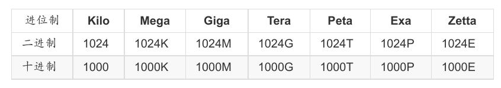

所谓的`位`指的是CPU一次数据读取的最大量!64位CPU代表CPU一次可以读写64bits这么多的数据,32位CPU则是CPU一次只能读取32位的意思。

`0/1`这个二进制的的单位我们称为	`bit`。但bit实在太小了,所以在储存数据时每份简单的数据都会使用到	`8	个	bits`	的大小来记录,因此定义出	`Byte`	这个单位,关系为:
`1	Byte	=	8	bits`

简化单位表达式,例如	`K`	代表	`1024Byte`,`M`	代表	`1024K	`等

一般来说,`文件大小`使用的是`二进制`的方式,所以	`1GBytes`	的文件大小实际上为:1024x1024x1024Bytes	这么大!	`速度单位`则常使用`十进制`,例如	`1GHz`	就是1000x1000x1000Hz	的意思。`CPU的运算速度`常使用	`MHz`	或者是	`GHz`	之类的单位,这个	`Hz	其实就是秒分之一`。而在`网络传输`方面,由于网络使用的是	bit	为单位,因此网络常使用的单位为	`Mbps`	是	Mbits	persecond,亦即是每秒多少	Mbit。

